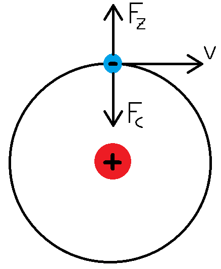
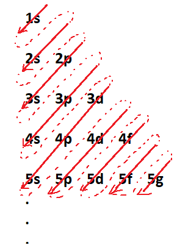

# Chemie

Die Chemie beschäftigt sich mit der Zusammensetzung, Struktur und den Eigenschaften von Stoffen, sowie den Kräften die dafür verantwortlich sind. Während bei physikalischen Prozessen die Stoffe die gleichen bleiben, werden bei chemischen Reaktionen Stoffe ineinander umgewandelt. Chemie bildet die Grundlage aller biologischen Vorgänge und liefert Werkzeuge, mit denen diese manipuliert und modifiziert werden können.

## Wichtige Erkenntnisse

* 1774 formulierte Antoine Lavoisier das Gesetz von der Erhaltung der Masse. Dieses besagt, dass sich die Gesamtmasse der Stoffe durch die Reaktion nicht ändert. In der Realität geht bei chemischen Bindungen ein Teil der Masse "verloren". Dies lässt sich dadurch erklären, dass die Massendifferenz in die Bindungsenergie umgewandelt wird. Das gleiche gilt auch auf subatomarer Ebene, weshalb ein Atom geringfügig leichter ist, als die Summe seiner Protonen, Neutronen und Elektronen. Da dieser **Massendefekt** allerdings so gering ist, dass er in den meisten Fällen nichteinmal messbar ist, kann er in der Regel vernachlässigt werden, weshalb das Massenerhaltungsgesetz dennoch gültig ist.

* 1808 führte John Dalton den Begriff des Atoms als kleinste, unteilbare Einheit der Materie ein. Heute weiß man zwar, dass das so nicht stimmt, allerdings bleiben in chemischen Reaktionen die Atome, abgesehen von ihren Valenzelektronen, ganz.

* 1905 experimentierte J.J. Thomson mit Kathodenstrahlen, um zu zeigen, dass sie aus geladenen Teilchen bestanden und in einem elektrischen oder magnetischen Feld abgelenkt wurden. Thomson stellte sich diese negativen Teilchen als eingebettet in ein ansonsten positiv geladenes Atom vor ("Rosinenkuchenmodell").

* 1910 führte Robert Andrews Millikan seinen Versuch durch, in dem er winzige, geladene Öltropfchen in einem elektrischen Feld zum Schweben brachte. Bei seinen Berechnungen fiel ihm auf, dass die sich ergebenden Ladungen immer Vielfache eines bestimmten Wertes waren. Daraus schloss er, dass es eine kleinstmögliche **Elementarladung** geben musste. Damit war die Ladung des Elektrons bekannt, und es konnte seine Masse berechnet werden.

* 1911 wurden unter der Leitung von Ernest Rutherford Experimente durchgeführt, bei denen $\alpha$-Teilchen durch eine dünne Goldfolie geschossen wurden. Nach dem damals vorherrschenden Thomson-Modell, bei dem die Atome massive Objekte sind, hätten die meisten oder alle dieser Teilchen abprallen müssen. Aus der Tatsache, dass die meisten gerade hindurchgingen oder nur abgelenkt wurden, schloss Rutherford, dass Atome aus großteils leerem Raum bestünden. Im **Rutherfordschen Atommodell** ist die positive Ladung, und der Großteil der Masse, im Nucleus des Atoms konzentriert, während die Elektronen darum kreisen.

* 1932 gelang James Chadwick der Nachweis eines elektrisch neutralen Teilchens, dessen Masse etwa der des Protons entspricht, dessen Existenz bereits von Rutherford postuliert worden war. Auch Messungen mit Massenspektrometern, aus denen herausging, dass das gleiche Element nicht immer dieselbe Masse hat, wiesen darauf hin.

## Wichtige Werte und Einheiten:

Elementarladung: $e = 1,602 * 10^{-19} \; C$

|Teilchen|Masse|Ladung|
|:---:|:---:|:---:|
|Elektron|$9,11 * 10^{-31} kg$|$-e$|
|Proton|$1,673 * 10^{-27} kg$|$+e$|
|Neutron|$1,675 * 10^{-27} kg$|$0 \; C$|

 
Ångström: $[Å] = 100 \; pm$ (pm = Pikometer = $10^{-12} \; m$)

Atom: ∅ $= 0,4 \; Å$ bis $2 \; Å$  
Atomkern: ∅ $= 10^{-5} \; Å$

## Elektromagnetische Strahlung

### Radioaktiver Zerfall

Beim radioaktiven Zerfall gibt es drei Arten von Strahlung, die frei werden kann: $\alpha$-Strahler setzen ein $\alpha$-Teilchen frei, das aus zwei Protonen und zwei Neutronen besteht (= 4He-Kern). Diese Art der Strahlung reicht nicht sehr weit und wird ohne Probleme von der Haut aufgehalten. $\beta$-Strahlung besteht aus Elektronen, die beim Zerfall von Neutronen in je ein Proton und ein Elektron entstehen. Die Strahlung mit der meisten Energie ist die $\gamma$-Strahlung, eine Form der elektromagnetischen Strahlung, besteht also aus Photonen mit hoher Energie.

### Das Bohrsche Atommodell (1913)

Wie im Rutherfordschen Modell ist auch hier die positive Ladung mit der meisten Masse im Zentrum konzentriert. Allerdings schwirren die Elektronen nicht wild umher, sondern kreisen auf geordneten Bahnen, die mit K, L, M, ... bezeichnet werden und je $2n^2$ Elektronen aufnehmen können (für n gilt $K = 1, L = 2, M = 3, ...$). Jeder dieser Bahnen ist ein Energieniveau zugeordnet, das höher liegt, je weiter die Bahn vom Atomkern entfernt ist. Bohr konnte diese Energie berechnen, da ihm die jeweiligen Ladungen der betreffenden Teilchen bekannt waren. Damit konnte er die Coulomb-Kraft zwischen ihnen berechnen. Damit ein Elektron auf einer Kreisbahn bleiben kann, muss die durch das Kreisen entstehende Zentrifugalkraft gleich der Coulomb-Kraft sein. Damit konnte er die Geschwindigkeit der Kreisbewegung und folglich die kinetische Energie des Elektrons berechnen.

<figure>
    
    <figcaption></figcaption>
</figure>

Wechselt ein Elektron von einer Bahn auf eine niedrigere, wird die Differenz der entsprechenden Energieniveaus in Form von Photonen abgegeben. Umgekehrt kann ein Elektron durch Absorbtion eines Photons auf eine höhere Bahn wechseln. Die Frequenz $\nu$ des Photons hängt dabei direkt mit der Energie zusammen:

<figure>
    <Formulae> E = h * \nu </Formulae>
    <figcaption>Planck-Gleichung</figcaption>
</figure>

<figure>
    <Formulae> h = 6,626 * 10^{-34} \; \frac {J} {s} </Formulae>
    <figcaption>Planck-Konstante</figcaption>
</figure>

Bei der Verbrennung eines Stoffes hat die Flamme eine charakteristische Färbung. Wird dieses Licht durch ein Prisma gebrochen, entsteht nicht wie bei Sonnenlich ein kontinuierliches Spektrum, sondern ein **Linienspektrum**. Dadurch kann durch Verbrennen einer Probe der betreffende Stoff identifiziert werden.

<figure>
    
    <figcaption> Linienspektrum von Quecksilber </figcaption>
</figure>

Dieses Phänomen wurde bereits vor der Entwicklung des Bohrschen Atommodells beobachtet. 1885 stellte Robert Balmer einer Formel auf, mit der die Wellenlänge und damit die Frequenz des Lichts berechnet werden konnte.

<figure>
    <Formulae> \frac {1} {\lambda} = R * (\frac {1} {4} - \frac {1} {n^2}) </Formulae>
    <figcaption>Balmer-Formel   R . . . empirisch ermittelte Konstante, später Rydberg-Konstante   n . . . Ganzzahl > 2</figcaption>
</figure>

Diese Formel war empirisch ermittelt, die Bedeutung von n war zu diesem Zeitpunkt noch nicht klar. Erst nachdem Johannes Rydberg die Gleichung verallgemeinert hatte, wurde klar, dass n für die Schale, aus der das Elektron kommt, steht. die Balmer-Formel war demnach ein Spezialfall für das Wasserstoffatom.

<figure>
    <Formulae> \frac {1} {\lambda} = R * (\frac {1} {{n_1}^2} - \frac {1} {{n_2}^2}) </Formulae>
    <figcaption>Rydberg-Formel</figcaption>
</figure>

Daraus lässt sich mit $\nu = \frac {\lambda} {c}$ die Frequenz berechnen.

## Welle-Teilchen-Dualismus des Elektrons

Das Bohrsche Atommodelle stellte einen großen Fortschritt für das Verständnis von Elektronen dar, doch es war auf viele reale Phänomene nicht anwendbar. So konnte es weder Mehrelektronensysteme noch den Mechanismus chemischer Bindungen oder den Zeeman-Effekt (Spektrallinien spalten sich in einem Magnetfeld auf) erklären. Außerdem verletzt eine genau definierte Kreisbahn die 1927 von Werner Heisenberg formulierte Unschärferelation, nach der Ort und Impuls eines Teilchens nicht beliebig genau bestimmt werden können.

<figure>
    <Formulae> \Delta x * \Delta p \geq \frac {h} {4 \pi} </Formulae>
    <figcaption>Heisenbergsche Unschärferelation</figcaption>
</figure>

In den 1920er Jahren setzte Louis de Broglie die Energie-Formeln von Einstein und Planck gleich.

<figure>
    <Formulae> \lambda = \frac {h} {m * c} </Formulae>
    <figcaption>de-Broglie-Gleichung   Verallgemeinernd kann statt c auch v als Geschwindigkeit eingesetzt werden.</figcaption>
</figure>

Da zu dieser Zeit bereits davon ausgegangen wurde, dass Licht sowohl Wellen- als auch Teilcheneigenschaften hatte, lag der Schluss nicht fern, dass ähnliches auch für Elektronen gelten könnte. Es wurde deshalb angenommen, dass sich Elektronen zwar im Kreis um den Atomkern bewegen, aber dabei wellenförmig um ihre Bahn schwingen. Damit konnten auch Bahnen festgelegt werden, da nur jene Bahnlängen möglich waren, die einem ganzzahligen Vielfachen der Wellenlänge des Elektrons entspricht.

## Schrödinger-Gleichung

<figure>
    <Formulae> H \Psi = E * \Psi </Formulae>
    <figcaption>H . . . Hamilton-Operator   Ψ . . . Wellenfunktion   E . . . Energiewerte, für die die Gleichung lösbar ist</figcaption>
</figure>

Jeder Energiewert $E_n$ hat eine dazugehörige Lösungsfunktion $\Psi _n$. Wenn die Wellenfunktion auf ein Kugelkoordinatensystem umgestellt und in ihre Bestandteile aufgeteilt wird, lassen sich die Quantenzahlen als Bedingungen für das Lösen ihrer Bestandteile erklären.

<figure>
    <Formulae> \Psi(r, \theta , \phi ) = R(r) * P(\theta ) * F(\phi ) </Formulae>
    <figcaption></figcaption>
</figure>

* **Hauptquantenzahl** n: Bedingung für $R(r)$ ist, dass $n > 0 \; \wedge \; n \in \N$
* **Nebenquantenzahl** l: Bedingung für $P(\theta )$ ist, dass $0 \leq l < n \; \wedge \; n \in \Z$
* **Magnetquantenzahl** m: Bedingung für $F(\phi )$ ist, dass $-l \leq m \leq l \; \wedge \; n \in \Z$

Nur wenn n, l und m diese Bedingungen erfüllen, kann die Wellenfunktion gelöst werden. $\Psi ^2$ gibt die Aufenthaltswahrscheinlichkeit des Elektrons in einem bestimmten Bereich an.

## Bedeutung der Quantenzahlen

Die Hauptquantenzahl gibt die Schale des Elektrons im Bohrschen Modell an.

|n|1|2|3|...|
|---|---|---|---|---|
|Schale|K|L|M|...|

Die Nebenquantenzahl bezeichnet die Unterschale, in der sich das Elektron wahrscheinlich aufhält. Jede Unterschale enthält $2l + 1$ Orbitale mit einer bestimmten Form.

|l|0|1|2|3|...|
|---|---|---|---|---|---|
|Unterschale|s|p|d|f|...|
|Orbitale|1|3|5|7|...|

Die Magentquantenzahl gibt die Ausrichtung des Orbitals an, in dem sich ein Elektron befindet. Damit lässt sich der Zeeman-Effekt erklären. Jedes Orbital kann bis zu zwei Elektronen aufnehmen.

|m|-l|-l + 1|-l + 2|...|l - 2|l - 2|l|
|---|---|---|---|---|---|---|---|

Zwei Elektronen im selben Atom müssen sich in mindestens einer Quantenzahl unterscheiden (Pauli-Prinzip). Da aber ein Orbital zwei Elektronen aufnehmen kann, können n, l und m gleich sein. Deshalb müssen sich diese beiden in ihrer **Spinquantenzahl** unterscheiden, die den Drehimpuls des Elektrons angibt.

|s|$- \frac {1} {2}$|$\frac {1} {2}$|
|---|---|---|

## Belegung von Atomorbitalen

Elektronen belegen zuerst Orbitale mit niedrigerem Energieniveau. Dabei gelten zwei Regeln:

* Pauli-Prinzip: zwei Elektronen im selben Orbital müssen unterschiedlichen Spin haben
* Hundsche Regel: Orbitale gleicher Energie werden zunächst einfach besetzt

Da beispielsweise das s-Orbital einer Schale energetisch niedriger liegt, als die d-Orbitale (wenn vorhanden, d-Orbital erst ab der dritten Schale) einer niedrigeren Schale, wird dieses zuerst besetzt, wodurch sich bei einer weiteren Besetzung der d-Orbitale die Zahl der Valenzelektronen nicht mehr ändert. Das erklärt auch das abweichende Muster der chemischen Eigenschaften von Nebengruppenelementen.

<figure>
    
    <figcaption>Besetzungsreihenfolge von Orbitalen</figcaption>
</figure>

Die Anzahl der Elektronen in einem Orbital wird schriftlich als Hochzahl nach der Bezeichnung des Orbitals angegeben und als Elektronenkonfiguration bezeichnet.

* H: 1s1
* He: 1s2
* C: 1s22s22p2

Atome mit exakt acht Außenelektronen sind besonders stabil. Elemente die diese Konfiguration standardmäßig innehaben, bezeichnet man als Edelgase (darum auch **Edelgaskonfiguration**). Der Teil der niederen Schalen kann in Elementen mit mehr Schalen in der Edelgasklammer zusammengefasst werden.

* He: 1s2 = [He]
* C: 1s22s22p2 = [He]2s22p2
* Ne: 1s22s22p6 = [He]2s22p6 = [Ne]
