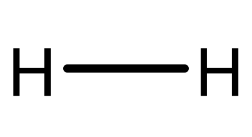
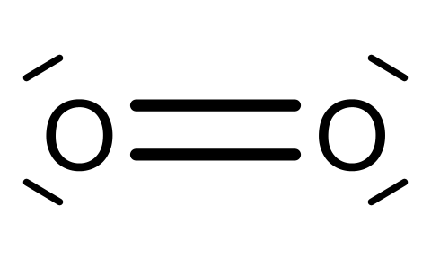
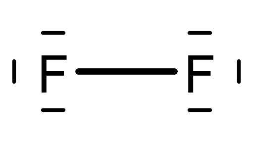
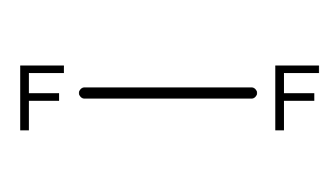
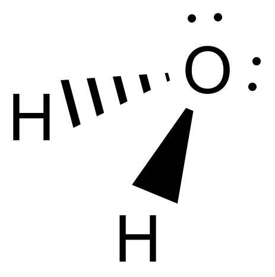
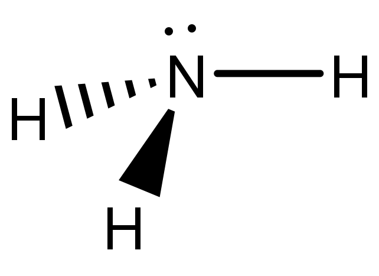
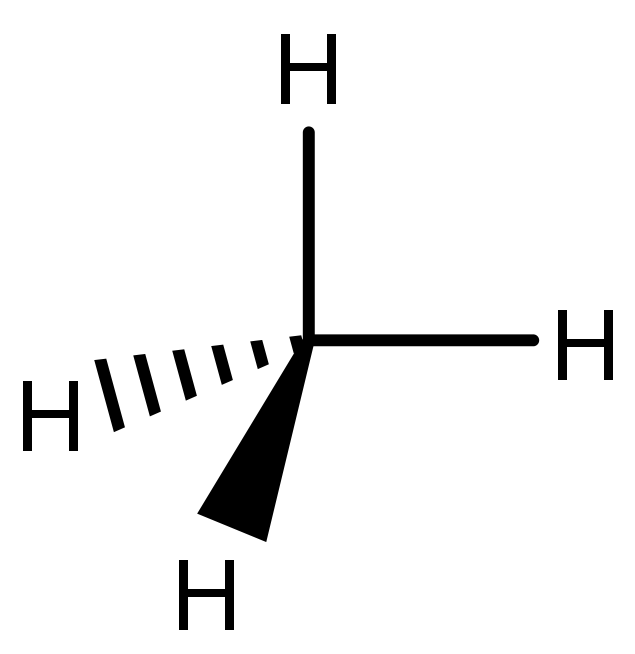
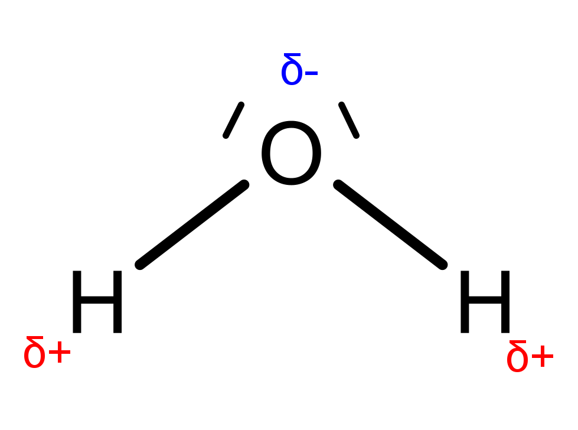
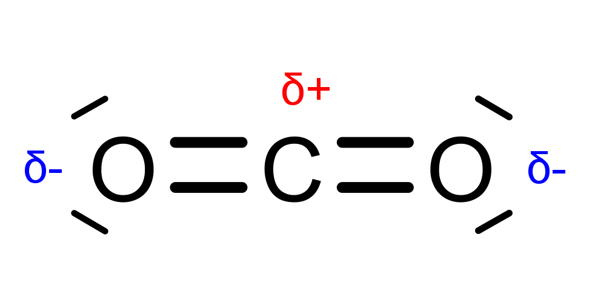
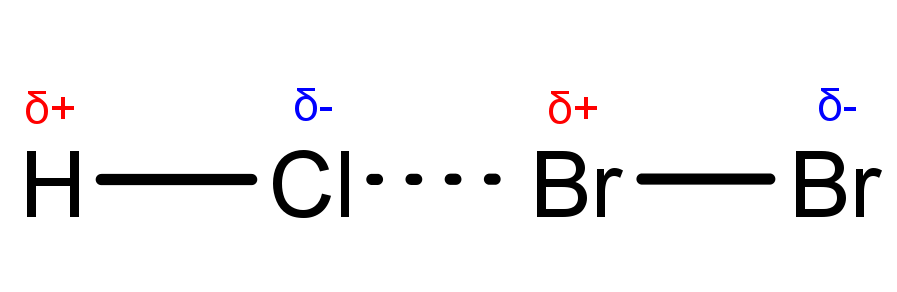

# Bindungen

## Kovalente Bindung

Kovalente Bindungen (Moleküle) bestehen aus zwei oder mehr Nichtmetallen, die bei chemischen und physikalischen Prozessen als Einheit fungieren. Die Eigenschaften (Schmelz- und Siedepunkt, Reaktivität, ...) lassen sich dabei nicht aus den Bestandteilen ableiten, und selbst ähnlich aussehende Moleküle können drastisch unterschiedliche Eigenschaften besitzen.

<figure>
  
  <figcaption>Molekularer Wasserstoff   Die H-Atome teilen sich ihre Valenzelektronen, dargestellt als Strich in der Mitte.</figcaption>
</figure>

### VB- und MO-Theorie

Die Valence-Bond-Theory stellt sich kovalente Bindungen als Überlappungen von Atomorbitalen vor. Da diese, wie alle Modelle, nur einen Teil der Wahrheit darstellen kann, wird für einige Phänomene die Molekülorbital-Theorie herangezogen. Bei dieser entstehen aus den Orbitalen der Atome gemeinsame Molekülorbitale, die von den an der Bindung beteiligten Valenzelektronen befüllt werden.

#### Bildung der Molekülorbitale

Die Benennung der Molekülorbitale erfolgt analog zu den Atomorbitalen (s, p, d, f, ...), allerdings mit griechischen Kleinbuchstaben (also $\sigma$, $\pi$, $\delta$, $\phi$, ...). Bei der Verbindung zweier Atomorbitale entstehen je ein bindendes und ein anti- oder nichtbindendes Molekülorbital ($\sigma$ und $\sigma$\*). Das bindende Orbital liegt dabei in seiner Energie niedriger als die ursprünglichen Atomorbitale, ist also energetisch günstiger, während das antibindende Orbital höher liegt. Je näher die Energieniveaus der Atomorbitale beieinander liegen, desto besser lassen sie sich kombinieren, und desto größer ist die Differenz zwischen bindendem und antibindendem Orbital. Wie ein Atomorbital kann auch ein Molekülorbital nur zwei Elektronen aufnehmen. Auch hier gelten sowohl Hundsche Regel als auch Pauli-Prinzip.

<figure>
  
  <figcaption>Molekülorbitale von H2</figcaption>
</figure>

##### Bindungsordnung

Die Bindungsordnung gibt die Anzahl der effektiven Bindungen zwischen zwei Atomen an. Sie entspricht der Hälfte der Differenz der Anzahl an Elektronen in bindenden bzw. antibindenden Orbitalen.

$$ BO = \frac { (e^-_\sigma - e^-_{ \sigma* }) } { 2 } $$

Da in Edelgasen alle Orbitale voll besetzt sind, wären auch alle Molekülorbitale, einschließlich der antibindenden, voll. Damit wäre die Bindungsordnung 0, die Bindung also höchst instabil.

<figure>
  
  <figcaption>Molekülorbitale von He2   Sowohl bindende als auch antibindende Orbitale sind voll besetzt, das Molekül ist nicht stabil.</figcaption>
</figure>

##### Beispiel: Molekularer Sauerstoff (O2)

<figure>
  
  <figcaption>Bildung der Molekülorbitale am Beispiel von Sauerstoff</figcaption>
</figure>

$$ BO = \frac { (8 - 4) } { 2 } = 2 $$

<figure>
  
  <figcaption>O2-Molekül   Die Elektronen einer der Bindungen (π*-Bindung) liegen in antibindenden Orbitalen. O2 ist ein Diradikal.</figcaption>
</figure>

<!--##### Form der Molekülorbitale-->

### Hybridisierung

Kohlenstoff hat vier Valenzelektronen, braucht also noch vier weitere, um die ideale Edelgaskonfiguration zu erreichen. Da die Orbitale aber auf zwei verschiedenen Energieniveaus liegen (2s < 2p), wird das s-Orbital voll besetzt, während die p-Orbitale zur zwei Elektronen erhalten. Dadurch hat der Kohlenstoff nur zwei einfach besetzte Orbitale, die an einer Bindung beteiligt sein könnten. Um trotzdem vier Elektronen aufnehmen zu können, werden die Orbitale auf ein gemeinsames Energieniveau gebracht, wo sie jeweils einfach mit Elektronen besetzt werden.

#### sp3-Hybridisierung

Wenn alle Orbitale zu vier gleichen sp3-Orbitalen hybridisiert werden, sind sie alle gleichwertig und nehmen auch den gleichen Abstand (109,5°) zueinander ein, wodurch eine Tetraeder-Form entsteht.

#### sp2-Hybridisierung

Bei Doppelbindungen zwischen C-Atomen werden nur drei sp2-Orbitale gebildet. Diese liegen dann in einer Ebene und liegen im Winkel von 120° auseinander. Das vierte Orbital, pz, hat das gleiche Energieniveau, steht aber im rechten Winkel auf der sp2-Ebene.

#### sp-Hybridisierung

Im Falle von Dreifachbindungen entstehen nur zwei gegenüberliegende sp-Orbitale. Die anderen beiden, py und pz, stehen im rechten Winkel zu dieser Achse sowie zueinander.

Eine Bindung zwischen zwei spn-Orbitalen nennt man $\sigma$-Bindung, eine Bindung zwischen zwei py bzw. pz bezeichnet man mit $\pi$.
Einfach-, Doppel- und Dreifachbindungen unterscheiden sich auch in ihrer Länge:

* Ethan (Einfachbindung): 1,54 Å
* Ethen (Doppelbindung): 1,35 Å
* Ethin (Dreifachbindung): 1,21 Å

### Struktur

#### Lewis-Formel

Bei der Lewis-Schreibweise werden die Außenelektronen als Punkte um das Elementsymbol angeschrieben.

Elektronenpaare können als Striche dargestellt werden.

Freie Elektronenpaare müssen nicht extra angeschrieben werden.

Die Lewis-Formel gibt nur an, wie die Atome verknüpft sind. Das entspricht aber nicht der tatsächlichen räumlichen Struktur.

#### Valence shell electron pair repulsion

Elektronenpaare nehmen aufgrund ihrer gleichen negativen elektrischen Ladung immer den größtmöglichen Abstand zueinander ein. Da freie Elektronenpaare nur von einem positiven Atomkern an ihrem Platz gehalten werden, nehmen sie mehr Raum ein, als bindende Paare, die von zwei Kernen eingeschränkt werden. Dadurch kommt es, in Abhängigkeit von den verschiedenen Bindungspartnern, zu bestimmten Winkeln zwischen den einzelnen Bindungen, was wiederum die räumliche Struktur des Moleküls bestimmt.

<table>
  <tbody>
    <tr>
      <td>
        <figure>
          
          <figcaption>Wasser   Bindungswinkel: 104,5°</figcaption>
        </figure>
      </td>
      <td>
        <figure>
          
          <figcaption>Ammoniak   Bindungswinkel: 109°</figcaption>
        </figure>
      </td>
      <td>
        <figure>
          
          <figcaption>Methan   Bindungswinkel: 109,5°</figcaption>
        </figure>
      </td>
    </tr>
  </tbody>
</table>

#### Polarität

Wenn sich zwei Bindungspartner in ihrer Elektronegativität unterscheiden, zieht einer der beiden die bindenden Elektronen stärker zu sich und bekommt dadurch eine negative Partialladung.

<figure>
  
  <figcaption>H2O mit seinen Partialladungen</figcaption>
</figure>

Damit auch tatsächlich ein polares Molekül vorliegt, muss es allerdings einen asymmetrischen Bau haben, da sich die Partialladungen sonst ausgleichen.

<figure>
  
  <figcaption>CO2 mit seinen Partialladungen</figcaption>
</figure>

$\qquad \Delta EN > 1,5 ⇒ polare \; kovalente \; Bindung$

$\qquad \Delta EN > 2 ⇒ Ionenbindung$

!!! Die Übergänge sind fließend. !!!

## Ionenbindung

Ionenbindungen (Salze) bestehen aus Stoffen mit großer Elektronegativitätsdifferenz (z.B. Metall und Nichtmetall). Wenn die Differenz größer als 2 ist, zieht der elektronegativere Partner die Bindungselektronen so stark an sich, dass er sie dem anderen komplett entreißt und so selbst negativ geladen wird, es entstehen Ionen (Anion (-) und Kation (+)). Ionen bilden deswegen keine Moleküle. Stattdessen werden sie durch Coulomb-Kräfte in einem Ionengitter zusammengehalten.

$$ F_C = \frac { Q_1 * Q_2 } { 4 * \pi * \epsilon_0 * \epsilon_r * r^2 } $$

Da es hier keine Moleküle gibt, kann eine Summenformel auch nicht die Anzahl der Ionen, aus denen ein Molekül besteht angeben. Stattdessen steht die Summenformel eines Salzes für das kleinste ganzzahlige Verhältnis von Anion und Kation.

<figure>
  
  <figcaption>Gitterstruktur von NaCl</figcaption>
</figure>

### Gitterenergie

Die Gitterenergie ist die Energie, die freiwürde, wenn man aus den gasförmigen Ionen das Ionengitter bildet. Sie steigt mit der Ladung der Ionen und sinkt mit zunehmendem Ionenradius.

$$ Na^+(g) \quad + \quad Cl^-(g) \quad \underset{788 \  kJ/mol}{\stackrel{-788 \  kJ/mol}{\rightleftharpoons}} \quad NaCl(s) $$

### Nomenklatur von Ionen

- einatomige Kationen:  
  Na+ = Natrium-Ion  
  Cu+ = Kupfer(I)-Ion  
  Cu2+ = Kupfer(II)-Ion
  
- mehratomige Kationen:  
  NH4+ = Ammo<u>nium</u>-Ion
  
- einatomige Anionen:  
  Cl- = Chlor<u>id</u>-Ion  
  O2- = Ox<u>id</u>-Ion  
  S2- = Sulf<u>id</u>-Ion
  
- mehratomige Anionen:  
  PO43- = Phosph<u>at</u>  
  SO42- = Sulf<u>at</u>

## Metallbindung

Die meisten Elemente im Periodensystem sind Metalle. Ihnen allen ist gemein, dass sie gute elektrische Leiter sind. Außerdem sind sie verformbar, ohne zu brechen. Sie glänzen meist metallisch grau.

### Elektronengasmodell

Das Elektronengasmodell ist eine vereinfachte Darstellung metallischer Bindungen. Man stellt sich dabei die Valenzelektronen als frei bewegliches "Gas" vor, das zwischen den positiv geladenen, fest im Gitter verankerten, "Atomrümpfen" (also den Kernen + Elektronen innerer Schalen) frei beweglich ist und so als Träger elektrische Ladung beim Stromfluss fungieren kann.

### Bändertheorie

Unter Zuhilfenahme der Molekülorbital-Theorie kann man sich vorstellen, dass die vielen Metall-Atome unzählige gemeinsame Molekülorbitale ausbilden. Dadurch entstehen zwei "Bänder": das Valenzband, auf dem die bindenden Elektronen in bindenden Orbitalen liegen, und das Leitungsband aus den antibindenden Orbitalen, auf dem sich Elektronen frei bewegen können. Diese beiden Bänder bilden gemeinsam das Energieband. In elektrischen Leitern liegen Valenz- und Leitungsband nahe beieinander. In Isolatoren hingegen besteht zwischen ihnen eine große Lücke. In Halbleitern ist die Lücke klein genug, dass sie, zum Beispiel durch Zuführen von Wärmeenergie, von den Elektronen überwunden werden kann.

<figure>
  
  <figcaption>Energiebänder bei Isolatoren, Halbleitern und Leitern</figcaption>
</figure>

## Koordinative Bindung

Bei koordinativen Bindungen liefert ein Partner (der Ligand) beide Bindungselektronen, die in ein leeres Orbital des zweiten Atoms aufgenommen werden.

<figure>
  
  <figcaption>Hexaammincobalt(III)-chlorid</figcaption>
</figure>

## Intermolekulare Wechselwirkungen

Zwischen Molekülen kann es zu Wechselwirkungen kommen, die in der Regel um mehrere Größenordnungen schwächer sind als molekulare Bindungen. Diese Wechselwirkungen beruhen auf drei Arten von Van-der-Waals-Kräften:

- Dipol-Dipol-Wechselwirkungen

  Die Partialladungen polarer Moleküle interagieren (= permanenter Dipol).

<figure>
  
  <figcaption>Wechselwirkungen in Salzsäure</figcaption>
</figure>

- Induktions-Wechselwirkungen

  Ein stark polares Molekül kann Ladungen in einem unpolaren Molekül verschieben (= induzierter Dipol).

<figure>
  
  <figcaption>Induzierter Dipol bei Brom</figcaption>
</figure>

- Dispersions-Wechselwirkungen (London-Kräfte)

  Durch die zufälligen Bewegungen von Elektronen kommt es vor, dass sie vorübergehend vor allem auf einer Seite sind (= temporärer Dipol).

Eine Sonderform der Dipol-Dipol-Wechselwirkungen sind Wasserstoffbrückenbindungen, bei denen ein Wasserstoff eines polaren Moleküls mit einem freien Elektronenpaar eines anderen interagiert. Diese sind aufgrund der stark positiven Ladung des Wasserstoffs besonders stark und spielen eine große Rolle in biologischen Systemen (DNA, RNA, Proteine).
Ein Nebeneffekt von Wasserstoffbrückenbindungen sind hydrophobe Wechselwirkungen, die darauf beruhen, dass Wasser und andere hydrophile Stoffe Moleküle meiden, mit denen sie keine Wasserstoffbrücken bilden können.

<figure>
  
  <figcaption>Wasserstoffbrückenbindungen zwischen Wassermolekülen</figcaption>
</figure>

**Bindungsenergien**:

kovalente u. ionische Bindungen: $300 - 900 \, kJ\!/\!mol$

Wasserstoffbrückenbindungen: $8 - 42 \, kJ\!/\!mol$

Van-der-Waals-Kräfte: $ca. \  10 \, kJ\!/\!mol$
