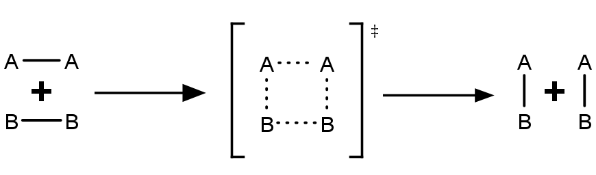

# Kinetik

Die Kinetik beschäftigt sich mit den Reaktionsgeschwindigkeiten chemischer Prozesse und dem Einfluss externer Faktoren auf diese. Nach der Stoßtheorie ist die Reaktionsgeschwindigkeit von drei Größen abhängig:

* Je mehr Teilchen vorhanden sind, desto größer ist die Wahrscheinlichkeit, dass zwei aufeinandertreffen und reagieren.
* Bei höherer Temperatur (und damit kinetischer Energie) steigt die Wahrscheinlichkeit, dass die betreffenden Teilchen ausreichend Energie haben, um zu reagieren.
* Teilchen, die im Winkel von 180° aufeinandertreffen (also direkt entgegengesetzte Geschwindigkeiten haben), können ein Maximum an Energie übertragen. "Streifschüsse" führen hingegen nicht zu einer Reaktion.

Die Reaktionsgeschwindigkeit v beschreibt die zeitliche Änderung der Konzentration von Reaktant bzw. Produkt. Für eine Reaktion der Form

<figure>
    <Formulae> aA + bB \rightarrow cC </Formulae>
    <figcaption>a, b, c . . . stöchiometrische Koeffizienten   A, B, C . . . Stoffe</figcaption>
</figure>

gilt:

<figure>
    <Formulae> v = - \frac {1} {a} * \frac {d c_A} {dt} = - \frac {1} {b} * \frac {d c_B} {dt} = \frac {1} {c} * \frac {d c_C} {dt} </Formulae>
    <figcaption> cA,  cB,  cC . . . Konzentrationen der Stoffe A, B, C</figcaption>
</figure>

Da chemische Reaktionen temperaturabhängig sind, wird die Geschwindigkeitskonstante k(T) eingeführt.

<figure>
    <Formulae> v = k(T) * \Pi c_{A_i} </Formulae>
    <figcaption>ΠcAi​ . . . Produkt aller Rektanten-Konzentrationen</figcaption>
</figure>

Die Geschwindigkeitskonstante kann durch die Arrhenius-Gleichung berechnet werden.

<figure>
    <Formulae> k(T) = A * e ^ {- {\frac {E_A} {R * T}}} </Formulae>
    <figcaption>A . . . Frequenzfaktor (stoffspezifische Konstante)   EA . . . Aktivierungsenergie</figcaption>
</figure>

Als Faustregel gilt, dass eine Temperaturerhöhung um 10K die Reaktion verdoppelt bis vervierfacht.

### Reaktionsordnung

Die Reaktionsordnung gibt an, wie stark eine Reaktion von den Reaktanten-Konzentrationen abhängt. Da die Einheit der Reaktionsgeschwindigkeit immer $1 \frac {mol} {L * s}$ ist, hängt auch die Einheit der Geschwindigkeitskonstante von der Reaktionsordnung ab.

Eine Reaktion nullter Ordnung ist vollkommen unabhängig von der Konzentration. Ein Beispiel ist der Abbau von Alkohol im Körper, der immer mit ca. $0.15 \frac {‰} {h}$ abläuft. Die Reaktionsgeschwindigkeit ist dann gleich der Geschwindigkeitskonstante, die Einheit dieser also $1 \frac {mol} {L * s}$.

<Formulae> v = k(T) </Formulae>

Für eine Reaktion erster Ordnung gilt

<Formulae> v = k(T) *  c_A </Formulae>

Da die Einheit der Stoffmengenkonzentration $1 \frac {mol} {L}$ ist, ist die Einheit der Geschwindigkeitskonstante $\frac {1} {s}$.
Bei einer Reaktion erster Ordnung kann zudem die Konzentration von A zu einem beliebigen Zeitpunkt einfach berechnet werden, sofern die Anfangskonzentration und die Geschwindigkeitskonstante bekannt sind.

<Formulae> c_A(t) = c_A(0) * e ^ {-k(T) * t} </Formulae>

Reaktionen zweiter Ordnung sind zum Beispiel Reaktionen der Form

<Formulae> A \; + \; B \; \rightarrow \; C </Formulae>

oder

<Formulae> 2 A \; \rightarrow \; C </Formulae>

Für sie gilt die Gleichung

<Formulae> v = k(T) * c_A * c_B </Formulae>

bzw.

<Formulae> v = k(T) * {c_A}^2 </Formulae>

Ähnliches gilt für Reaktionen dritter Ordnung:

<Formulae> 2 A \; + \; B \; \rightarrow \; C </Formulae>

<Formulae> v = k(T) * {c_A}^2 * c_B </Formulae>

### Reaktionsmechanismus

Der Reaktionsmechanismus beschreibt die Reihenfolge, in der die Bindungen gebrochen bzw. neu gebildet werden.

<figure>
    
    <figcaption>Reaktionsmechanismus der Benzoin-Addition</figcaption>
</figure>

Zwischen zwei Schritten liegt ein Übergangszustand vor, der extrem instabil ist und nicht isoliert werden kann.

<figure>
    
    <figcaption>Die gestrichelten Linien stellen die Verbindungen dar, die in diesem Schritt gebrochen bzw. neu gebildet werden.</figcaption>
</figure>

Der Reaktionsmechanismus wird durch Katalysatoren so geändert, dass eine niedrigere Aktivierungsenergie notwendig ist.

## Massenwirkungsgesetz

Viele chemische Reaktionen laufen mit einer simultanen Rückreaktion ab. Dabei stellt sich irgendwann ein Gleichgewicht ein, das vom Verhältnis der jeweiligen Reaktionsgeschwindigkeiten abhängt. Wenn das Gleichgewicht erreicht ist, laufen beide Reaktionen weiter ab, aber mit der jeweils gleichen Geschwindigkeit, sodass sie sich ausgleichen.

<figure>
    <Formulae> H_2 \; + \; I_2 \; \rightarrow \; 2 HI </Formulae>
    <figcaption>Hinreaktion</figcaption>
</figure>

<figure>
    <Formulae> 2 HI \; \rightarrow \; H_2 \; + \; I_2 </Formulae>
    <figcaption>Rückreaktion</figcaption>
</figure>

<figure>
    <Formulae> H_2 \; + \; I_2 \; \rightleftharpoons \; 2 HI </Formulae>
    <figcaption>Gleichgewichtsreaktion</figcaption>
</figure>

Für eine allgemeine Gleichgewichtsreaktion $aA \; + \; bB \; \rightleftharpoons \; cC \; + \; dD$ gilt für die Hin- bzw. Rückreaktion:

<Formulae> v_H = k_H * {c_A}^a * {c_B}^b </Formulae>
<Formulae> v_R = k_R * {c_C}^c * {c_D}^d </Formulae>

Da ein Gleichgewicht dann vorliegt, wenn $v_H = v_R$, kann man diese beiden Gleichungen gleichsetzen und umformen, um so die reaktionsspezifische und temperaturabhängige Gleichgewichtskonstante K zu erhalten:

<Formulae> \frac {k_H} {k_R} = \frac {{c_C}^c * {c_D}^d} {{c_C}^c * {c_D}^d} = K </Formulae>

Das Gleichgewicht zwischen Reaktanten und Endprodukten mehrstufiger Reaktionen mit den Gleichgewichtstkonstanten $K_1, K_2, ...$ liegt, unabhängig von den Zwischenprodukten, bei

<Formulae> K = K_1 * K_2 * ... = \Pi K_i </Formulae>

### Prinzip des kleinsten Zwangs von Henry LeChatelier

Ein im Gleichgewicht befindliches System weicht Zwängen (Bedingungsänderungen) aus. Wird zum Beispiel die Konzentration eines Stoffes erhöht, so stellt sich ein neues Gleichgewicht ein.

### Freie Enthalpie im Gleichgewicht

<Formulae> \Delta G = \Delta G° + R * T * ln(K) </Formulae>

Im Gleichgewicht gilt $\Delta G = 0$, daher kann die obige Gleichung umgeformt werden:

<Formulae> \Delta G° = - R * T * ln(K) </Formulae>

Die freie Standardenthalpie $\Delta G°$ ist eine reaktionsspezifische Konstante. Wenn diese bekannt ist, kann man daraus die Gleichgewichtskonstante bei einer gegebenen Temperatur berechnen.

### Gleichgewicht in Lösungen

Lösungen sind homogene Mischungen aus mindestens zwei Stoffen. Wenn ein Salz in einem polaren Lösungsmittel gelöst wird, lagern sich die dipolaren Lösungsmittelmoleküle an die geladenen Ionen an und drängen sie aus ihrer Gitterstruktur. Bei diesem Vorgang wird Energie frei bzw. verbraucht. Das Lösen eines Stoffes in einem Lösungsmittel nennt man Solvatation (Hydratation beim Lösungsmittel Wasser).

<Formulae> Lösungsenthalpie = Gitterenthalpie + Solvatationsenthalpie </Formulae>

NaCl hat eine Gitterenthalpie von $+778 \frac {kJ} {mol}$ und eine Solvatationsenthalpie von $-774 \frac {kJ} {mol}$. Daraus ergibt sich eine Lösungsenthalpie von $+4 \frac {kJ} {mol}$, es findet also eine leichte Abkühlung statt, weil Energie hineingesteckt werden muss.

Stoffe, die in Wasser zu Ionen dissoziieren, bezeichnet man als Elektrolyte. Starke Elektrolyte dissoziieren (fast) vollständig, während sich schwache Elektrolyte nicht gänzlich lösen. Den Anteil des Stoffes, der gelöst wird, bezeichnet man mit dem Dissoziationsgrad $\alpha$, er ist für starke Elektrolyte ~1.

Zwischen der dissoziierten und der undissoziierten Form entsteht ein Gleichgewicht, die Solvatation kann also als Gleichgewichtsreaktion betrachtet werden.

<Formulae> AB \; \rightleftharpoons \; A^+ \; + \; B^- </Formulae>

Damit gilt für die Gleichgewichtskonstante:

<Formulae> K = \frac {c_{A^+} * c_{B^-}} {c_{AB}} </Formulae>

Daraus lässt sich das Löslichkeitsprodukt $K_L$ definieren:

<Formulae> K_L = K * c_{AB} = c_{A^+} * c_{B^-} </Formulae>

Da $AB$ in gleichem Maße in $A^+$ wie auch in $B^-$ dissoziiert, gilt:

<Formulae> K_L = {c_{A^+}}^2 => c_{A^+} = \sqrt {K_L}</Formulae>

Löslichkeit:

<Formulae> L = \sqrt [a + b] {\frac {KL} {a ^ a * b ^ b}} </Formulae>
