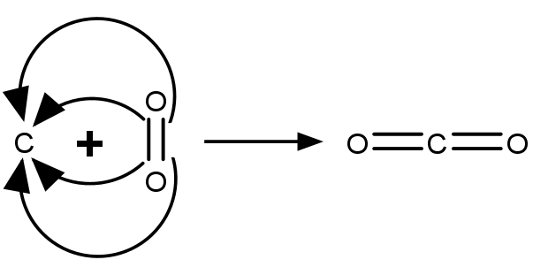

# Elektrochemie

## Redox-Reaktionen

Der Begriff der Redox-Reaktion geht auf Antoine Lavoisier zurück. Redox-Reaktionen bestehen aus einer **Red**uktion und einer **Ox**idation, die nur gemeinsam ablaufen können. Ursprünglich bezogen sich diese Begriffe ausschließlich auf Reaktionen, bei denen Sauerstoff freigesetzt bzw. verbraucht wird. Heute umfasst er allgemein Elektronenübertragungsreaktionen.

Bei einer Redox-Reaktion wird das **Oxidationsmittel/Oxidans** reduziert und das **Reduktionsmittel/Reduktor** oxidiert. Eine Reduktion ist gleichbedeutend mit einer Elektronenaufnahme, während bei einer Oxidation Elektronen abgegeben werden.

In Redox-Reaktionen zeigen gekrümmte Pfeile von einem Atom oder einer bestehenden Bindung zu einem anderen Atom die Übertragung der Elektronen an.

<figure>
    
    <figcaption>Verbrennung von Kohle</figcaption>
</figure>

### Oxidationszahlen

Die Oxidationszahl (OZ) eines Atoms gibt die hypothetische Ladung an, die dieses Atom hätte, wenn in jeder seiner Bindungen beide Elektronen zur Gänze beim jeweils elektronegativeren Partner lägen.

**Regeln für das zuweisen von Oxidationszahlen:**

1. In einer elementaren Verbindung hat jedes Atom OZ = 0.
2. Die OZ eines einatomigen Ions ist immer gleich seiner Ladung.
3. Alkali- bzw. Erdalkalimetalle haben in kovalenten Bindungen immer OZ = +1 bzw. OZ = +2.
4. Wasserstoff hat in Bindungen mit Nichtmetallen immer OZ = +1. (Ausnahme: Hydride -> OZ = -1)
5. Sauerstoff hat immer OZ = -2. (Ausnahme: Peroxide und $O-F$ -> OZ = -1)
6. Flour hat immer OZ = -1.

Die Summe der Oxidationszahl von ungeladenen Molekülen ist immer 0.
Die Summe der Oxidationszahlen eines mehratomigen Ions ist immer gleich seiner Ladung.

Bei einer Reduktion werden vom Atom Elektronen aufgenommen, die Ladung und damit die Oxidationszahl sinkt. Umgekehrt steigt bei einer Oxidation infolge der Elektronenabgabe die Oxidationszahl.

**Edle Metalle** neigen eher dazu, Elektronen aufzunehmen und liegen vorwiegend in Metallform vor. **Unedle Metalle** lassen sich dagegen leicht oxidieren und liegen vor allem als Ion vor.

Analog zu konjugierten Säure-Basen-Paaren gibt es auch Redox-Paare.

<figure>
    <Formulae> Red \; \rightleftharpoons \; Ox \; + \; n \: e^- </Formulae>
    <figcaption>Red . . . reduzierte Form (= Reduktionsmittel)   Ox . . . oxidierte Form (= Oxidationsmittel)</figcaption>
</figure>

### Lösen von Redox-Gleichungen

Wenn nur die beteiligten Stoffe bekannt sind, aber nicht die notwendigen stöchiometrischen Koeffizienten, kann man diese mithilfe der Oxidaitonszahlen bestimmen und so die Reaktionsgleichung ausgleichen.

Am Beispiel der Reaktion von Chlorat und Iod zu Iodat und Chlorid:

**1. Bestimmen der Oxidationszahlen**

<Formulae> ClO_3^- \; + \; I_2 \; \rightarrow \; IO_3^- \; + \; Cl^- </Formulae>

* Reaktanten
    * für ClO3-:

        $OZ_{ClO_3^-} = -1$ (mehratomiges Ion)  
        $OZ_O = -2$ (zweite Regel)  
        $OZ_{Cl} = OZ_{ClO_3^-} - 3 * OZ_O = +5$

    * für I2:

        $OZ_I = 0$ (erste Regel)

* Produkte
    * für IO3-:

        $OZ_{IO_3^-} = -1$ (mehratomiges Ion)  
        $OZ_O = -2$ (zweite Regel)  
        $OZ_{I} = OZ_{IO_3^-} - 3 * OZ_O = +5$

    * für Cl-:

        $OZ_{Cl^-} = -1$ (zweite Regel)

**2. Berechnen der Änderung der Oxidationszahl der einzelnen Atome**

$\Delta OZ_{Cl} = -6$  
$\Delta OZ_I = +5$

**3. Eintragen von $\Delta OZ$ als stöchiometrischer Koeffizient des jeweils anderen Atoms**

<Formulae> 5ClO_3^- \; + \; 3I_2 \; \rightarrow \; 6IO_3^- \; + \; 5Cl^- </Formulae>

**4. Bestimmen der gesamten Ladung jeder Seite**

$Q_{Reaktanten} = 5 * -1 + 3 * 0 = -5$  
$Q_{Produkte} = 6 * -1 + 5 * -1 = -11$

**5. Ausgleichen von Ladungen und Massen**

<Formulae>3H_2O \; + \; 5ClO_3^- \; + \; 3I_2 \; \rightarrow \; 6IO_3^- \; + \; 5Cl^- \; + \; 6H^+ </Formulae>

## Elektrolyse

Elektrolyte wie NaCl dissoziieren in Wasser oder bei hoher Temperatur zu geladenen Ionen. Wenn man Elektroden in die Lösung einbringt, kann man mit einer Stromquelle einen Stromfluss induzieren und so die Ionen trennen. An der elektrisch negativen Kathode werden Elektronen in das Elektrolyt abgegeben, dorthin fließen also die positiven Kationen (im Falle von NaCl: Na+). An der elektrisch positiven Anode reagieren die Cl--Anionen zu Chlorgas (Cl2), wobei zwei Elektronen frei werden, die über die Anode in den Stromkreis eintreten.

<figure>
    
    <figcaption>Allgemeine elektrolytische Leitung mit Strom- und Spannungsmesser</figcaption>
</figure>

<figure>
    <Formulae> Na^+ \; + \; e^- \; \rightarrow \; Na </Formulae>
    <figcaption>Reduktion von Natrium-Ionen an der Kathode</figcaption>
</figure>

<figure>
    <Formulae> 2Cl^- \; \rightarrow \; Cl_2 \; + \; 2e^- </Formulae>
    <figcaption>Oxidation von Chlorid an der Anode</figcaption>
</figure>

In **elektrolytischen Zellen** wird eine an sich nicht freiwillige Reaktion durch eine angelegte Spannung erzwungen. In **galvanischen Zellen** (z.B. Batterien) wird durch eine freiwillige Reaktion eine Spannung erzeugt. Beides sind Formen von **elektrochemischen Zellen**.

<figure>
    
    <figcaption>Funktionsprinzip einer Kupfer-Zink-Batterie (galvanische Zelle)</figcaption>
</figure>

**Elektrodentypen:**

* Metall|Metallionen-Elektroden (M|M+(aq)) bestehen aus einem Metall und seinem gelösten Ion.
* Metall|Salz-Elektroden (M|MX|X-(aq)) sind von einer Schicht aus einem Salz des Metalls mit dem gelösten Anion umgeben.
* Gaselektroden (Pt|H2|H+(aq)) bestehen auseinem Inertmetall wie Platin. In der Lösung sind Protonen gelöst, die sich an der Kathode (wo Elektronen abgegeben werden) zu Wasserstoffgas verbinden.

### Elektrolyse von Wasser

Bei der Elektrolyse von Wasser entstehen elementarer Wasserstoff und Sauerstoff. An der Kathode wird Wasser in Protonen und Hydroxid-Ionen gespalten. Die Protonen reagieren mit den freien Elektronen aus der Kathode zu Wasserstoffgas (Kathodenprozess). An der Anode wird ebenfalls Wasser gespalten, allerdings reagieren diesmal die Sauerstoff-Atome unter der Abgabe von Elektronen.

<figure>
    <Formulae> 2H_2O \; \rightleftharpoons \; 2H^+ \; + 2OH^- </Formulae>
    <Formulae> 2H^+ \; + \; 2e^- \rightarrow \; H_2 </Formulae>
    <figcaption>Kathodenprozess</figcaption>
</figure>

<figure>
    <Formulae> 2H_2O \; \rightleftharpoons \; 2H^+ \; + 2OH^- </Formulae>
    <Formulae> 2OH^- \; \rightarrow \; \frac 1 2 O_2 \; + \; H_2O \; + \; 2e^- </Formulae>
    <figcaption>Anodenprozess</figcaption>
</figure>

<figure>
    <Formulae> 2H_2O \;  \rightarrow \; 2H_2 \; + \; \frac 1 2 O_2 </Formulae>
    <figcaption>Gesamtprozess</figcaption>
</figure>

### Faraday-Gesetz

Aus der molaren Masse M eines Ions, dem Betrag z seiner Ionenladung, der gesamten geflossenen Ladung Q während der Elektrolyse sowie der Faraday-Konstante F kann man die Menge (in kg) dieses Ions messen, die aus dem Elektrolyt abgeschieden wird.

<Formulae> m = \frac {M * Q} {z * F} </Formulae>

<figure>
    <Formulae> F = 96485 \frac C {mol} </Formulae>
    <figcaption>Faraday-Konstante</figcaption>
</figure>

### Elektronenmotorische Kraft (electron motive force, EMF)

<figure>
    <Formulae> \Delta E = \frac {\Delta G} {n * F} </Formulae>
    <figcaption>elektrochemische Gleichgewichtsbedingung   ΔE . . . Zellspannung (= EMF)   n . . . Stoffmenge der Elektronen (in mol)</figcaption>
</figure>

Ob eine elektrochemische Zelle galvanisch oder elektrolytisch ist, hängt neben der freien Enthalpie (Freiwilligkeit der Reaktion) auch von der angelegten elektrischen Spannung ab. Wenn der Term $\Delta G + n * F * \Delta E$ kleiner als 0 ist, arbeitet die Zelle galvanisch. Bei einem Wert größer 0 liegt eine elektrolytische Zelle vor. Durch Anlegen einer Spannung kann also der Prozess einer galvanischen Zelle umgekehrt werden (z.B. Aufladen eines Akkus).

Wenn an eine elektrochemische Zelle eine Spannung angelegt und so lange anpasst, bis kein Strom mehr fließt (bis also die elektrochemische Gleichgewichtsbedingung erfüllt ist), kann man so die freie Enthalpie einer Reaktion messen.

An einer Elektrode entsteht durch den entsprechenden Elektrodenprozess ein **Elektrodenpotential**, dass an einer anderen Elektrode abgebaut werden muss, bevor die Reaktion weiterlaufen kann. Für die Norm-Wasserstoffelektrode wurde willkürlich das Elektrodenpotential $E^0 = 0$ festgelegt, von dem aus die Elektrodenpotentiale $\Delta E^0$ gemessen werden.

<figure>
    <Formulae> \Delta E = \Delta E^0 + \frac {R * T} {n * F} * ln(Q) </Formulae>
    <figcaption>Nernst-Gleichung   Q . . . Reaktionquotient (Reaktant/Produkt)</figcaption>
</figure>
