# Kohlenwasserstoffe

Die organische Chemie befasst sich mit den Stoffen, aus denen alle bekannten Organismen bestehen. Dies sind die meisten Kohlenstoffverbindungen, mit ausnahme von elementarem Kohlenstoff und anorganischen Verbindungen wie Kohlenstoffdioxid. Die Grundform dieser organischen Kohlenstoffverbindungen sind **Kohlenwasserstoffe**, sie bestehen aus mehr oder weniger langen Kohlenstoffketten mit Wasserstoff-**Substituenten**. Die häufigsten Elemente sind neben Kohlenstoff und Wasserstoff vor allem Sauerstoff, Stickstoff, Schwefel und Phosphor, die anstelle von Wasserstoff als **Heteroatome** an einen Kohlenstoff gebunden sein können. Zu den organischen (Makro-)Molekülen gehören zum Beispiel auch Proteine, Saccharide und die DNA.
Die H-Atome sind in einem Tetraeder um den Kohlenstoff angeordnet.

<figure>
    
    <figcaption>Tetraederform der Orbitale des (sp3-hybridisierten) Kohlenstoffs</figcaption>
</figure>

<figure>
    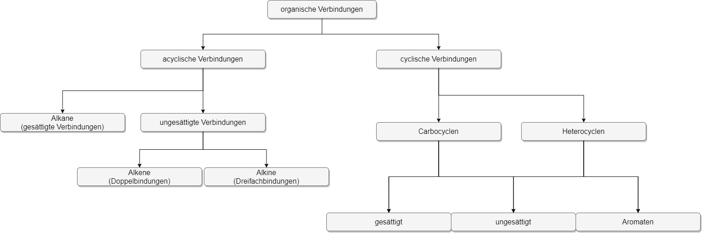
    <figcaption>Überblick über die Arten von organischen Verbindungen</figcaption>
</figure>

## Geschichte

Der Begründer der organischen Chemie war Jöns Jakob Berzelius, der Begriffe wie Katalyse, Protein, Polymer und Isomer prägte. Friedrich Wöhler war der erste, der, anhand von Harnstoff, zeigte, dass organische Moleküle auch bei anorganischen Prozessen entstehen kann. Das führte zur Widerlegung der lange Zeit vorherrschenden Ansicht, dass Lebewesen eine Art "Lebenskraft" innewohne, die organische Prozesse ermöglicht.

## Darstellung

Kohlenwasserstoffe werden oft in der **Skelettformel** gezeichnet, um die Darstellung übersichtlicher und einfacher zu machen. Die Kohhlenstoffe sind darin die Punkte, an denen Linien (die die Bindungen darstellen) aufeinandertreffen. Wasserstoffe werden normalerweise nicht extra angeschrieben (implizite Wasserstoffe). Andere Substituenten werden durch eine Linie mit einem Kohlenstoffpunkt verbunden. Manchmal werden die endständigen Kohlenstoffatome angeschrieben.

<figure>
    
    
    <figcaption>Lewis- und Skelettformel von Butan</figcaption>
</figure>

<figure>
    
    <figcaption>Linolsäure</figcaption>
</figure>

<figure>
    
    <figcaption>Maitotoxin</figcaption>
</figure>

## Funktionelle Gruppen

Heteroatome wie Schwefel, aber auch ganze Kohlenwasserstoffe oder andere **Seitenketten** sind als funktionelle Gruppen maßgeblich für die Stoffeigenschaften von Kohlenwasserstoff-Derivaten verantwortlich. Viele von diesen hängen eine bestimmte Endung an den Namen des Kohlenwasserstoffs an.

### Priorität

Die Priorität ist für viele Aspekte der Beschreibung und Benennung von Kohlenwasserstoffen und davon abgeleiteten Molekülen wichtig (z.B. cis/trans, Positionszahl).

**Cahn-Ingold-Prelog-Regeln:**

1. Das Atom mit der höheren Ordnungszahl hat die höhere Priorität.
2. Doppelbindungen zählen stärker als Einfachbindungen, Dreifachbindungen wiederum stärker als Doppelbindungen.
3. Wenn zwei Atome in der ersten Sphäre gleich sind, wird die zweite Sphäre verglichen (also das jeweils zweite Atom der Seitenketten).

### Wichtige funktionelle Gruppen

<table>
    <thead>
        <tr>
            <th>Name</th>
            <th>Struktur</th>
            <th>Endung</th>
        </tr>
    </thead>
    <tbody>
        <tr>
            <td>Alkohol</td>
            <td>
                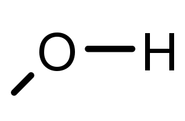
            </td>
            <td>-ol</td>
        </tr>
        <tr>
            <td>Aldehyd (Carbonylgruppe mit Wasserstoff)</td>
            <td>
                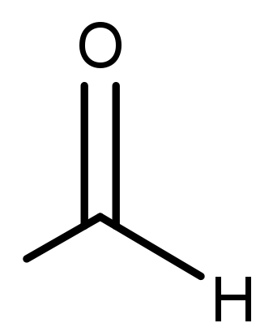
            </td>
            <td>-al</td>
        </tr>
        <tr>
            <td>Carbonsäure (Carboxylgruppe)</td>
            <td>
                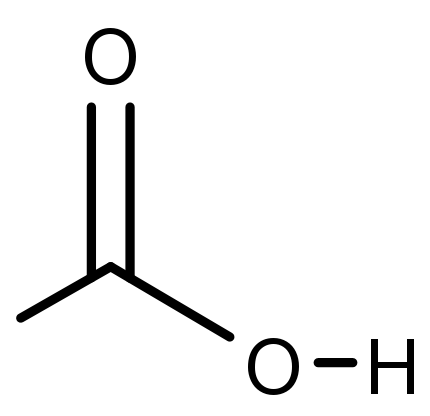
            </td>
            <td>-säure</td>
        </tr>
        <tr>
            <td>Keton (Carbonylgruppe mit organischem Rest)</td>
            <td>
                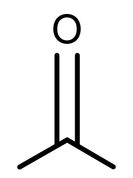
            </td>
            <td>-on</td>
        </tr>
        <tr>
            <td>Ester</td>
            <td>
                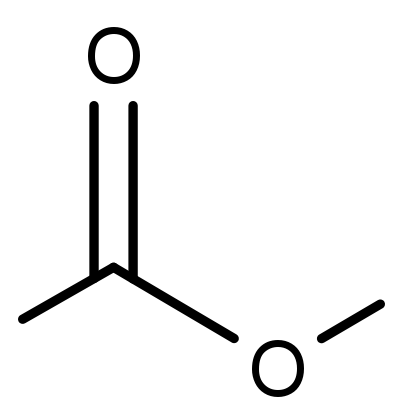
            </td>
            <td>-oat</td>
        </tr>
        <tr>
            <td>Carbamat</td>
            <td>
                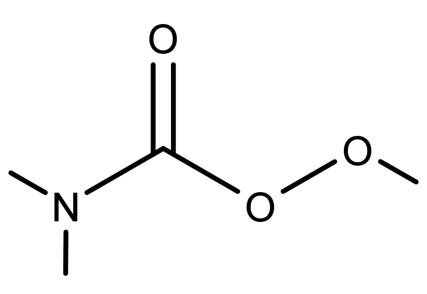
            </td>
            <td>-carbamat</td>
        </tr>
        <tr>
            <td>Carbonat</td>
            <td>
                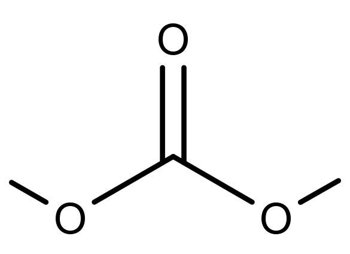
            </td>
            <td>-carbonat</td>
        </tr>
        <tr>
            <td>Ether</td>
            <td>
                
            </td>
            <td>-ether</td>
        </tr>
        <tr>
            <td>Peroxid</td>
            <td>
                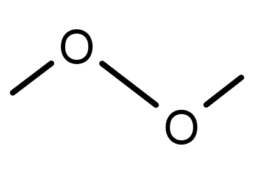
            </td>
            <td>-peroxid</td>
        </tr>
        <tr>
            <td>Amin</td>
            <td>
                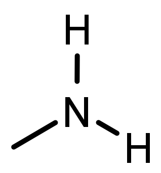
            </td>
            <td>-amin</td>
        </tr>
        <tr>
            <td>Nitro</td>
            <td>
                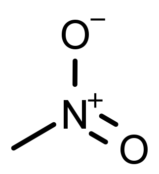
            </td>
            <td>-nitrat</td>
        </tr>
        <tr>
            <td>Amid</td>
            <td>
                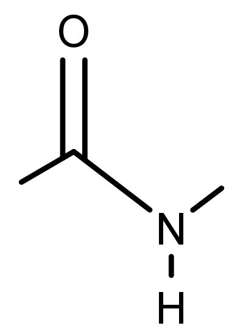
            </td>
            <td>-amid</td>
        </tr>
        <tr>
            <td>Nitril</td>
            <td>
                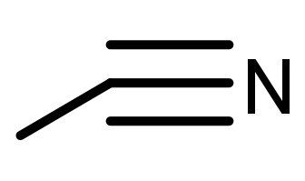
            </td>
            <td>-nitril</td>
        </tr>
        <tr>
            <td>Thiol</td>
            <td>
                
            </td>
            <td>-thiol</td>
        </tr>
        <tr>
            <td>Sulfid</td>
            <td>
                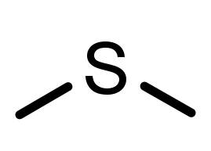
            </td>
            <td>-sulfid</td>
        </tr>
        <tr>
            <td>Disulfid</td>
            <td>
                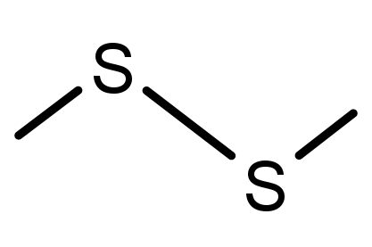
            </td>
            <td>-disulfid</td>
        </tr>
        <tr>
            <td>Sulfon</td>
            <td>
                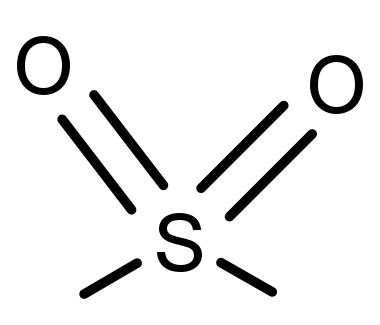
            </td>
            <td>-sulfon</td>
        </tr>
    </tbody>
</table>