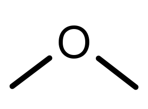

# Kohlenwasserstoffe

Die organische Chemie befasst sich mit den Stoffen, aus denen alle bekannten Organismen bestehen. Dies sind die meisten Kohlenstoffverbindungen, mit ausnahme von elementarem Kohlenstoff und anorganischen Verbindungen wie Kohlenstoffdioxid. Die Grundform dieser organischen Kohlenstoffverbindungen sind **Kohlenwasserstoffe**, sie bestehen aus mehr oder weniger langen Kohlenstoffketten mit Wasserstoff-**Substituenten**. Die häufigsten Elemente sind neben Kohlenstoff und Wasserstoff vor allem Sauerstoff, Stickstoff, Schwefel und Phosphor, die anstelle von Wasserstoff als **Heteroatome** an einen Kohlenstoff gebunden sein können. Zu den organischen (Makro-)Molekülen gehören zum Beispiel auch Proteine, Saccharide und die DNA.

## Geschichte

Der Begründer der organischen Chemie war Jöns Jakob Berzelius, der Begriffe wie Katalyse, Protein, Polymer und Isomer prägte. Friedrich Wöhler war der erste, der, anhand von Harnstoff, zeigte, dass organische Moleküle auch bei anorganischen Prozessen entstehen kann. Das führte zur Widerlegung der lange Zeit vorherrschenden Ansicht, dass Lebewesen eine Art "Lebenskraft" innewohne, die organische Prozesse ermöglicht.

## Funktionelle Gruppen

Heteroatome wie Schwefel, aber auch ganze Kohlenwasserstoffe oder andere **Seitenketten** sind als funktionelle Gruppen maßgeblich für die Stoffeigenschaften von Kohlenwasserstoff-Derivaten verantwortlich. Viele von diesen hängen eine bestimmte Endung an den Namen des Kohlenwasserstoffs an.

### Wichtige funktionelle Gruppen

<table>
    <thead>
        <tr>
            <th>Name</th>
            <th>Struktur</th>
            <th>Endung</th>
        </tr>
    </thead>
    <tbody>
        <tr>
            <td>Alkohol</td>
            <td>
                
            </td>
            <td>-ol</td>
        </tr>
        <tr>
            <td>Aldehyd</td>
            <td>
                
            </td>
            <td>-al</td>
        </tr>
        <tr>
            <td>Carbonsäure</td>
            <td>
                
            </td>
            <td>-säure</td>
        </tr>
        <tr>
            <td>Keton</td>
            <td>
                
            </td>
            <td>-on</td>
        </tr>
        <tr>
            <td>Ester</td>
            <td>
                
            </td>
            <td>-oat</td>
        </tr>
        <tr>
            <td>Carbamat</td>
            <td>
                
            </td>
            <td>-carbamat</td>
        </tr>
        <tr>
            <td>Carbonat</td>
            <td>
                
            </td>
            <td>-carbonat</td>
        </tr>
        <tr>
            <td>Ether</td>
            <td>
                
            </td>
            <td>-ether</td>
        </tr>
        <tr>
            <td>Peroxid</td>
            <td>
                
            </td>
            <td>-peroxid</td>
        </tr>
        <tr>
            <td>Amin</td>
            <td>
                
            </td>
            <td>-amin</td>
        </tr>
        <tr>
            <td>Nitro</td>
            <td>
                
            </td>
            <td>-nitrat</td>
        </tr>
        <tr>
            <td>Amid</td>
            <td>
                
            </td>
            <td>-amid</td>
        </tr>
        <tr>
            <td>Nitril</td>
            <td>
                
            </td>
            <td>-nitril</td>
        </tr>
        <tr>
            <td>Thiol</td>
            <td>
                
            </td>
            <td>-thiol</td>
        </tr>
        <tr>
            <td>Sulfid</td>
            <td>
                
            </td>
            <td>-sulfid</td>
        </tr>
        <tr>
            <td>Disulfid</td>
            <td>
                
            </td>
            <td>-disulfid</td>
        </tr>
        <tr>
            <td>Sulfon</td>
            <td>
                
            </td>
            <td>-sulfon</td>
        </tr>
    </tbody>
</table>