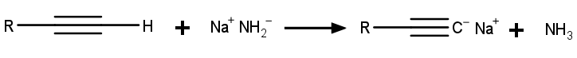

# Aliphatische Kohlenwasserstoffe

Aliphatische Kohlenwasserstoffe sind all jene Kohlenwasserstoffe, die nicht aromatisch sind, sowohl linear als auch cyclisch, gesättigt wie ungesättigt. Sie werden nach dem Vorhandensein oder der Abwesenheit von Doppel- beziehungsweise Dreifachbindungen in Alkane, Alkene und Alkine eingeteilt.

## Alkane

In Alkanen sind die Kohlenstoffe ausschließlich durch Einfachbindungen verbunden. Schmelz- und Siedepunkt werden vor allem durch die Kettenlänge bestimmt. Je länger die Kohlenstoffkette ist, desto mehr Van-der-Waals-Bindungen können zwischen den Atomen benachbarter Alkane gebildet werden. Isomere haben geringere Schmelz- und Siedepunkte, weil Seitenketten die Bildung von Van-der-Waals-Bindungen behindern.

<figure>
    <Formulae> C_nH_{2n+2} </Formulae>
    <figcaption>allgemeine Summenformel der Alkane</figcaption>
</figure>

### Nomenklatur

Alkane enden auf -an und werden grundsätzlich so benannt, dass die Zahl ihrer Kohlenstoffatome im Namen steckt (auf griechisch). Die vier kürzesten haben abweichende Namen.

<table>
    <thead>
        <tr>
            <th>Name</th>
            <th>Summenformel</th>
            <th>Skelettformel</th>
        </tr>
    </thead>
    <tbody>
        <tr>
            <td>Methan</td>
            <td><Formulae> CH_4 </Formulae></td>
            <td></td>
        </tr>
        <tr>
            <td>Ethan</td>
            <td><Formulae> C_2H_6 </Formulae></td>
            <td>
                
            </td>
        </tr>
        <tr>
            <td>Propan</td>
            <td><Formulae> C_3H_8 </Formulae></td>
            <td>
                
            </td>
        </tr>
        <tr>
            <td>Butan</td>
            <td><Formulae> C_4H_{10} </Formulae></td>
            <td>
                
            </td>
        </tr>
        <tr>
            <td>Pentan</td>
            <td><Formulae> C_5H_{12} </Formulae></td>
            <td>
                
            </td>
        </tr>
        <tr>
            <td>Hexan</td>
            <td><Formulae> C_6H_{14} </Formulae></td>
            <td>
                
            </td>
        </tr>
        <tr>
            <td>Heptan</td>
            <td><Formulae> C_7H_{16} </Formulae></td>
            <td>
                
            </td>
        </tr>
        <tr>
            <td>Octan</td>
            <td><Formulae> C_8H_{18} </Formulae></td>
            <td>
                
            </td>
        </tr>
        <tr>
            <td>Nonan</td>
            <td><Formulae> C_9H_{20} </Formulae></td>
            <td>
                
            </td>
        </tr>
        <tr>
            <td>Dekan</td>
            <td><Formulae> C_{10}H_{22} </Formulae></td>
            <td>
                
            </td>
        </tr>
    </tbody>
</table>

Für verzweigte Ketten hat die International Union of Pure and Applied Chemistry (**IUPAC**) ein Benennungsschema festgelegt.

**1. Die längste durchgängige Kette liefert den Stammnamen.**

<figure>
    
    <figcaption>Nonan (rot)</figcaption>
</figure>

**2. Seitenketten werden entsprechend ihrer Länge zu Alkylen (Methan -> Methyl, Ethan -> Ethyl, ...).**

<figure>
    
    <figcaption>Ethyl (grün) und Methyl (gelb)</figcaption>
</figure>

**3. Die Positionszahl entlang der Hauptkette werden so zugeteilt, dass das Alkyl mit der höchsten Priorität die geringstmögliche Ziffer bekommt.**

<figure>
    
    <figcaption>Numerierung der Hauptkette</figcaption>
</figure>

**4. Gleiche Alkyle werden mit Mono- (optional), Di-, Tri-, etc. zusammengefasst und nach dem Alphabet vor den Stammnamen gestellt. Jeder Alkylrest bekommt seine Positionszahl vorangeschrieben.**

<Formulae> 4-Ethyl-6-methylnonan </Formulae>

Wenn mehrere gleichnamige Alkylreste vorhanden sind: z.B. $2,4-Diethyl-6-Methylnonan$

### Cycloalkane

Alkane können auch cyclisiert vorliegen. An den Namen eines cyclischen Alkans wird vorne das Präfix Cyclo- angehängt. Seitenketten funktionieren grundsätzlich gleich. Die Position 1 ist das Kohlenstoffatom mit der Seitenkette mit höchster Priorität. Dann wird in die Richtung gezählt, in der die Seitenkette mit der zweithöchsten Priorität näher ist. Die Nomenklatur erfolgt ähnlich wie bei "normalen" Alkanen. Vor den Stammnamen wird die Vorsilbe Cyclo- angehängt (z.B. Cyclohexan). Die Positionsnummerierung beginnt beim Substituenten mit der höchsten Priorität.

<figure>
    <Formulae> C_nH_{2n} </Formulae>
    <figcaption>allgemeine Summenformel der Cycloalkane</figcaption>
</figure>

<figure>
    
    <figcaption>Cyclopropan - Cyclobutan - Cyclopentan - Cyclohexan</figcaption>
</figure>

## Alkene

Alkene sind Kohlenwasserstoffe mit mindestens einer sp2-hybridisierten Doppelbindung. Dabei liegen die drei sp2-Orbitale in einer Ebene, mit jeweils einem Winkel von 120° zwischen ihnen. Das verbleibende pz-Orbital steht normal zu dieser Ebene und geht mit dem Elektron im pz-Orbital des Bindungpartners eine **$\pi$-Bindung** ein. Da der energetisch günstigste Zustand der ist, in dem sich die Orbitale genau überlappen, ergeben sich genau zwei mögliche **Konfigurationen** (cis/trans), und keine freihe Drehbarkeit. Das kleinste Alken ist Ethen, da ein einatomiger Kohlenwasserstoff keine Doppelbindung haben kann (d.h. es gibt kein Methen).

<figure>
    <Formulae> C_nH_{2n} </Formulae>
    <figcaption>allgemeine Summenformel der Alkene</figcaption>
</figure>

<figure>
    
    <figcaption>Ethen mit π-Bindung (grün)</figcaption>
</figure>

### Nomenklatur

Die Benennung erfolgt grundsätzlich analog zu den Alkanen, mit wenigen Zusätzen:

* Der Stammname endet auf -en statt -an (Ethen, Propen, Buten, usw.)
* Die Position der Seitenkette wird nach den Substituenten (also direkt vor dem Stammnamen) angegeben, wobei die Position wieder möglichst klein sein soll (mit geringerer Priorität als Seitenketten). Wenn mehrere Doppelbindungen vorhanden sind, wird die Anzahl vor der Nachsilbe -in angegeben (z.B. "Penta**di**en).
* Für Seitenketten mit einer Doppelbindung werden of Trivialnamen verwendet (z.B. Ethen -> Vinyl, Propen -> Allyl)

<figure>
    
    <figcaption>5-Allyl-1-nonen</figcaption>
</figure>

### Polyene

In einem Kohlenwasserstoff können auch mehrere Doppelbindungen vorkommen.

* **Kumulierte** Doppelbindungen liegen direkt nebeneinander.
* **Isolierte** Doppelbindungen sind voneinander getrennt.
* **Konjugierte** Doppelbindungen liegen immer abwechselnd mit einer Einfachbindung vor. Da alle C-Atome sp2-hybridisiert sind, lässt sich nicht festlegen wo genau die Einfach- und wo die Doppelbindungen sind (Mesomerie).

### Reaktionen

#### Hydrierung

Alkene können durch Hydrierung zu Alkanen werden. Diese Reaktion muss durch einen Katalysater (Nickel, Palladium, Platin) unterstützt werden.

<figure>
    
    <figcaption>Hydrierung eines Alkens zu einem Alkan</figcaption>
</figure>

#### Addition an konjugierte Doppelbindungen

Durch die Mesomerie konjugierter Doppelbindungen kann ein Reaktant auf verschiedene Weise mit dem Polyen reagieren. Das genaue Verhältnis der Produkte hängt von den Reaktionsbedingungen ab.

<figure>
    
    <figcaption>Addition von Bromwasserstoff an eine konjugierte Doppelbindung</figcaption>
</figure>

## Alkine

Alkine haben mindestens eine Dreifachbindung zwischen zwei sp-hybridisierten C-Atomen. Die sp-Orbitale liegen 180° auseinander, während die beiden p-Orbitale (py und pz) normal dazu und zueinander stehen. Da die Bindungspartner der C-Atome jeweils genau gegenüber liegen, gibt es keinen Unterschied zwischen Konformationen, Konfigurationen etc.

<figure>
    <Formulae> C_nH_{2n-2} </Formulae>
    <figcaption>allgemeine Summenformel der Alkine</figcaption>
</figure>

### Nomenklatur

Die Benennung erfolgt gleich wie bei den Alkanen und Alkenen, mit der Endsilbe -in statt -an oder -en. Wenn in einem Molekül sowohl Doppel- als auch Dreifachbindungen vorhanden sind, haben die Dreifachbindungen eine höhere Priorität.

### Chemische Eigenschaften

Alkine sind leicht deprotonierbar und haben deswegen eine relativ hohe Acidität im Vergleich zu Alkenen und Alkanen.

<figure>
    
    <figcaption>Alkin deprotoniert bei Anwesenheit einer starken Base zu einem Acetylid</figcaption>
</figure>

Eine durch beispielsweise Pd/C (Palladium auf Kohlenstoff) katalysierte Hydrierung eines Alkins zu einem Alken würde sofort zu einem Alkan weiter hydrieren. Um das zu verhindern, werden **Lindlar-Katalysatoren** verwendet, die so abgeschwächt sind, dass die katalytische Wirkung für die Hydrierung des Alkens nicht ausreicht. Bei solchen Reaktionen entstehen cis-Alkene.

<figure>
    
    <figcaption>Hydrierung von Phenylacetylen zu Styrol durch einen Lindlar-Katalysator</figcaption>
</figure>
