# Aromatische Kohlenwasserstoffe

Aromatische Kohlenwasserstoffe, oder **Aromaten** sind planare, cyclische und ungesättigte Kohlenwasserstoffe mit $4n+2 \; \; (n \in \N)$ $\pi$-Elektronen in ihrem Ringsystem. Alle Winkel in einem aromatischen Ring betragen 120°. Einer der einfachsten Aromaten ist Benzen (oder Benzol), $C6H6$, mit 6 $\pi$-Elektronen ($n=2$).

<figure>
    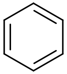
    <figcaption>Benzen</figcaption>
</figure>

Anders, als man es bei dieser Darstellung erwarten würde, sind die Bindungen nicht verschieden lang, wie es für Doppel- und Einfachbindungen normalerweise der Fall wäre. Stattdessen liegt die Bindungslänge dazwischen. Auch die Standardbildungsenthalpie $\Delta H^0$ für die Hydrierung verhält sich anders, als zu erwarten wäre. Den Unterschied zwischen erwarteter und realer Hydrierungsenthalpie ist die **Resonanzenergie**, die dafür sorgt, dass ein Molekül mit mesomeren Grenzstrukturen stabiler ist, als es ohne die Mesomerie wäre.

<figure>
    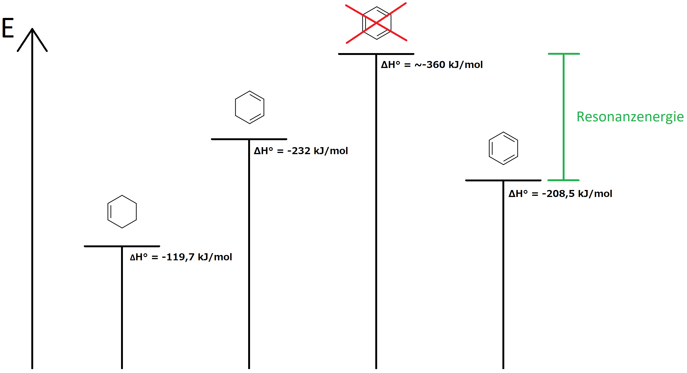
    <figcaption>Hydrierungsenthalpie von Einfachringen mit Doppelbindungen</figcaption>
</figure>

Durch diese Resonanzstabilisierungen sind Aromaten weniger reaktiv. Reaktionen mit Elektrophilen laufen nur gemeinsam mit einem Katalysator ab. Reaktionspartner werden substituiert nicht addiert, wodurch die Doppelbindung erhalten bleibt. 

<figure>
    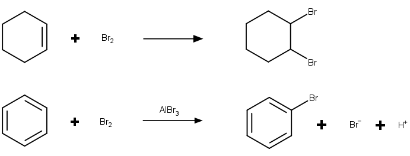
    <figcaption>Addition an Cyclohexan und Substitution an Benzen</figcaption>
</figure>

## Mesomerie

Die mesomeren Formen von Molekülen sind keine Reaktanten und Produkte, die miteinander im Gleichgewicht stehen. Sie sind Näherungen der Realität (**Grenzstrukturen**). Benzen hat fünf verschiedene Strukturen, mit denen man die Mesomerie darstellen kann.

<figure>
    
    <figcaption>Kekulé- (erste und zweite) und Dewar-Strukturen des Benzens</figcaption>
</figure>

<figure>
    
    <figcaption>allgemeine Schreibweise</figcaption>
</figure>

## Hückel-Regeln

Jedes planare, cyclische System mit $4n+2$ $\pi$-Elektronen ist aromatisch stabilisiert. Das gilt auch für Ionen und Heterocyclen mit freien Elektronenpaaren.

<figure>
    
    <figcaption>Beispiele für aromatische Systeme</figcaption>
</figure>

Systeme mit $4n$ $\pi$-Elektronen sind **Antiaromaten**. Diese Moleküle sind energetisch destabilisiert und damit reaktiver.

<figure>
    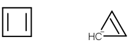
    <figcaption>Beispiele für antiaromatische Systeme</figcaption>
</figure>

## Anellierte Ringe

Aromatische Ringe können auch aneinandergefügt (anelliert) werden. Aromatizität ist dann gegeben, wenn im gesamten Molekül $4n+2$ $\pi$-Elektronen vorhanden sind, nicht in jedem Ring.

<table>
    <tbody>
        <tr>
            <td>
                <figure>
                    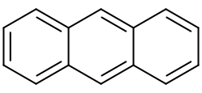
                    <figcaption>Anthracen</figcaption>
                </figure>
            </td>
            <td>
                <figure>
                    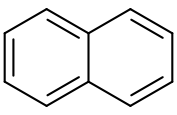
                    <figcaption>Naphtalin</figcaption>
                </figure>
            </td>
        </tr>
    </tbody>
</table>

## Heteroaromaten

Wenn ein Heteroatom in einem aromatischen Ring ein freies Elektronenpaar hat, das im Inneren des Ringes liegt, kann dieses an der aromatischen Bindung beteiligt sein. Wenn es außen liegt, hat es keinen Anteil an der Aromatizität.

<figure>
    
    <figcaption>Pyrol, Furan und Thiophen: freies Elektronenpaar im Ring</figcaption>
</figure>

<figure>
    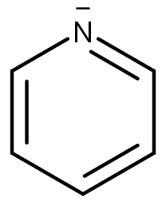
    <figcaption>Heteroatom mit außenliegendem Elektronenpaar</figcaption>
</figure>

## Nomenklatur von Aromaten

**1.** Substituenten werden vor den Namen des Aromaten geschrieben.

<table class="gallery-table">
    <tbody>
        <tr>
            <td>
                <figure>
                    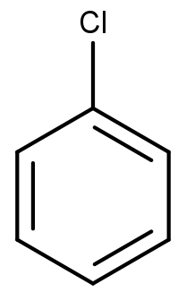
                    <figcaption>Chlorbenzen</figcaption>
                </figure>
            </td>
            <td>
                <figure>
                    
                    <figcaption>Nitrobenzen</figcaption>
                </figure>
            </td>
        </tr>
    </tbody>
</table>

**2.** Die Regeln für mehrfache Substitution sind gleich den aliphatischen Kohlenwasserstoffen

<figure>
    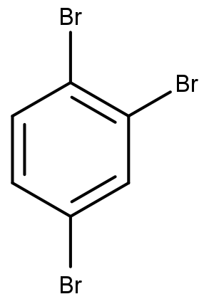
    <figcaption>1,2,4-Tribrombenzen</figcaption>
</figure>

**3.** Positionsziffern werden wie bei Cykloalkanen vergeben.

**&**

**4.** Wenn verschiedene Substituenten vorhanden sind, werden diese alphabetisch gereiht.

<figure>
    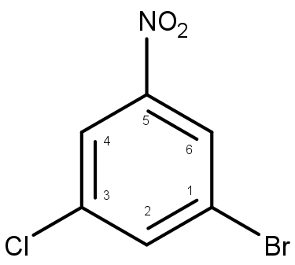
    <figcaption>1-Brom-3-chlor-5-nitrobenzen</figcaption>
</figure>

**5.** Wenn ein Trivialname für den Aromaten mit einem der Substituenten existiert, wird dieser als Basis verwendet. Die Positionsziffern beginnen mit 1 für den Substituenten des Stammmoleküls.

<figure>
    
    <figcaption>Brombenzoesäure</figcaption>
</figure>

Aromaten haben oft einen gebräuchlichen Trivialnamen. Wenn ein Aromat zwei Substituenten hat, kann auch deren relative Stellung zueinander statt der Positionsziffern angegeben werden.

<table class="gallery-table">
    <tbody>
        <tr>
            <td>
                <figure style="margin: 0px; width: 80px">
                    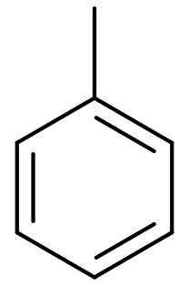
                    <figcaption>Toluol</figcaption>
                </figure>
            </td>
            <td>
                <figure style="margin: 0px; width: 80px">
                    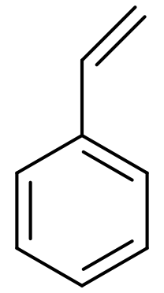
                    <figcaption>Styrol</figcaption>
                </figure>
            </td>
            <td>
                <figure style="margin: 0px; width: 80px">
                    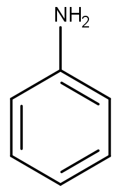
                    <figcaption>Anilin</figcaption>
                </figure>
            </td>
            <td>
                <figure style="margin: 0px; width: 80px">
                    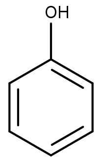
                    <figcaption>Phenol</figcaption>
                </figure>
            </td>
            <td>
                <figure style="margin: 0px; width: 80px">
                    
                    <figcaption>Benzaldehyd</figcaption>
                </figure>
            </td>
            <td>
                <figure style="margin: 0px; width: 80px">
                    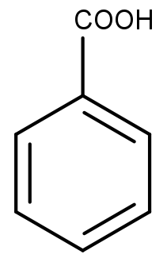
                    <figcaption>Benzoesäure</figcaption>
                </figure>
            </td>
        </tr>
    </tbody>
</table>

<table class="gallery-table">
    <tbody>
        <tr>
            <td>
                <figure>
                    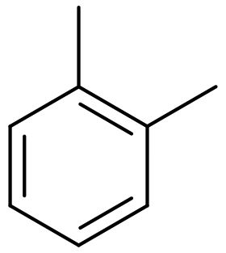
                    <figcaption>ortho</figcaption>
                </figure>
            </td>
            <td>
                <figure>
                    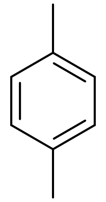
                    <figcaption>para</figcaption>
                </figure>
            </td>
            <td>
                <figure>
                    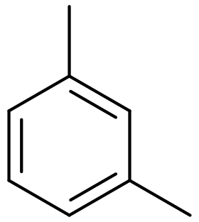
                    <figcaption>meta</figcaption>
                </figure>
            </td>
        </tr>
    </tbody>
</table>
