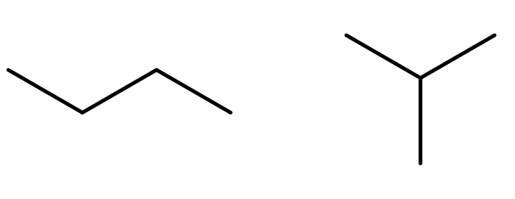
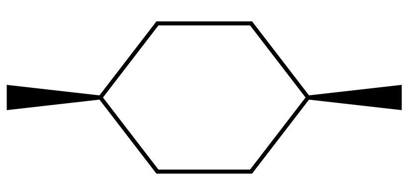
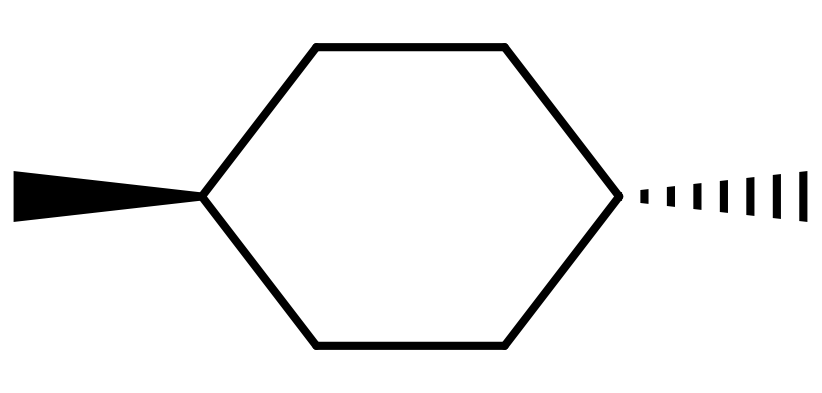
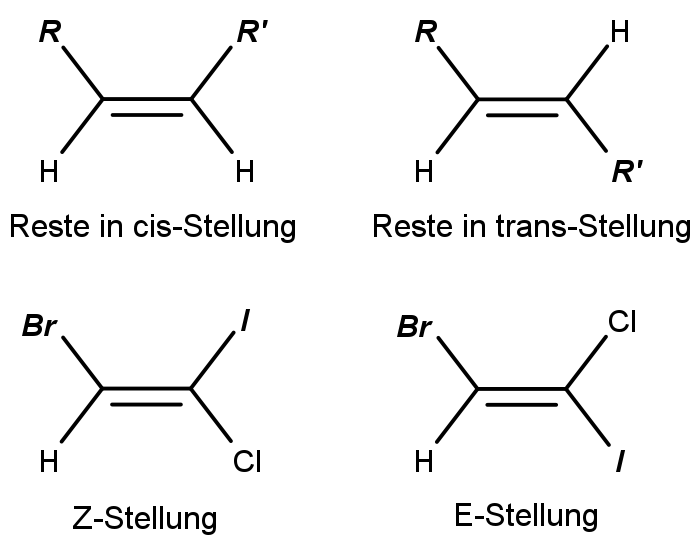

# Stereochemie

Die Stereochemie beschäftigt sich mit Molekülen, die zwar die gleiche Summenformel und Konstitution haben, sich aber irgendwie in ihrem Aufbau unterscheiden (= Stereoisomere).

## Isomerie

Moleküle mit gleicher Summenformel können sich in ihrem Aufbau oder ihrer räumlichen Anordnung unterscheiden.

<figure>
    
    <figcaption>Überblick über die Arten der Isomerie</figcaption>
</figure>

* **Homomere** sind vollkommen idente Moleküle
* **Isomere** unterscheiden sich in der Verknüpfung oder räumlichen Anordnung
    * **Konstitutionsisomere** unterscheiden sich in der Reihenfolge, in der ihre Atome verknüpft sind
    * **Stereoisomere** haben die gleiche Konstitution, können aber nicht durch Rotation des ganzen Moleküls zur Deckung gebracht werden
        * **Konformationsisomere** unterscheiden sich in der Rotation der C-Atome zueinander (anti- oder gauche-Konformation oder gleich), und können durch Drehung einer Bindung ineinander übergeführt werden
        * **Konfigurationsisomere** lassen sich nicht ineinander überführen, ohne Bindungen zu brechen
            * **Enantiomere** gleichen sich wie Bild und Spiegelbild (Chiralität)
            * **Diastereomere** können cis/trans-Isomere oder Kohlenwasserstoffe mit mehreren Chiralitätszentren sein

<figure>
    
    <figcaption>Konstitutionsisomerie von Propan/Methylbutan</figcaption>
</figure>

## Konformere (Rotamere)

Einfachbindungen können frei rotiert werden, ohne Bindungen zu brechen. Trotzdem sind gewisse Konformationen energetisch günstiger als andere, da sich die Substituenten gegenseitig abstoßen und den größtmöglichen Abstand einnehmen.

<figure>
    
    <figcaption>Sägebock- und Newman-Projektion von Butan</figcaption>
</figure>

Am günstigsten ist die Konformation, in der sich die Substituenten 180° (staggered/gestaffelt/anti) gegenüberstehen (bei gleichen Substituenten: 180° = 60° = 300°). Die Stellungen bei 60° bzw. 300° (gauche/windschief) sind ebenfalls stabil, allerdings auf einem höheren Energieniveau als staggered. Die instabilste Konformation ist die bei 0° bzw. 360° (überlappend/ekliptisch).

<figure>
    
    <figcaption>Energieniveaus der Konformationen   A: staggered   B: gauche   C: teilweise verdeckt   D: ekliptisch</figcaption>
</figure>

### Cycloalkane

Durch die entgegengesetzten Wirkungen der durch die Tendenz zum Tetraeder erzeugten **Winkelspannung** und der durch Neigungen zu bestimmten Konformationen verursachten **Drehspannung** kommt es in Cycloalkanen zu verschiedenen, mehr oder weniger stabilen Konformationen.

<figure>
    
    <figcaption>Konformationen von Cyclohexan</figcaption>
</figure>

Durch den Vorgang der **Ringinversion** kann z.B. Cyclohexan von einer Sesselkonfiguration in eine andere wechseln. Wenn an einem Kohlenstoffatom ein Substituent hängt, wird dieser dabei von der **axial-** in die **äquatorial-Position** gebracht. Ein Substituent interagiert in der axialen Stellung über 1,3-diaxiale Wechselwirkungen mit axialen Wasserstoff-Atomen oder anderen Substituenten, was diese Konformation energetisch ungünstiger macht. Dementsprechend wird die Konformation bevorzugt, in der Substituenten nach Möglichkeit äquatorial stehen.

Wenn ein Ring zwei Substituenten hat, können diese in die gleiche Richtung oder in entgegengesetzte Richtungen zeigen. Es kommt also zu einer cis/trans-Isomerie.

<figure>
    
    
    <figcaption>cis- und trans- Konfiguration von 1,4-Dimethylcyclohexan</figcaption>
</figure>

## Enantiomere

Enantiomere entstehen, wenn ein C-Atom vier verschiedene Substituenten hat (**chirales Zentrum**). Dadurch können zwei Formen des Moleküls entstehen, die grundsätzlich die gleichen chemischen Eigenschaften haben. Allerdings reagieren sie in unterschiedlicher Weise mit anderen chiralen Stoffen. Dadurch haben sie zum Beispiel unterschiedlichen Geschmack, Geruch oder physiologische Wirkungen.

<figure>
    
    <figcaption>Enantiomere von Thalidomid (Contergan)   S-Thalidomid (links) ist teratogen, während R-Thalidomid eine sedierende Wirkung hat</figcaption>
</figure>

Eine weitere Eigenschaft ist ihre **optische Aktivität**.

### Racemisierung

Wenn polarisiertes Licht durch ein Enantiomer fällt, wird es um einen bestimmten Winkel rotiert. Der Winkel hängt vom jeweiligen Stoff ab, hat aber bei zusammengehörenden Enantiomeren den gleichen Betrag, mit unterschiedlichem Vorzeichen. Deswegen gleichen sich diese Wirkungen in einem Gemisch, das zu gleichen Teilen aus beiden Enantiomeren besteht (**Racemat**), genau auf. Solche Gemische sind optisch inaktiv Ein Racemat kann auf verschiedene Weise getrennt werden, um ein bestimmtes Enantiomer zu erhalten.

1. Die Kristalle können bei Feststoffen oft unter dem Mikroskop unterschieden und getrennt werden (historisch).
2. Da biologische Enzyme chirale Moleküle sind, kann man mit ihnen Racemate trennen, indem nur eines der Enantiomere abgebaut wird.
3. Ähnlich funktionieren kinetische Verfahren, bei denen chirale Reaktanten verschieden schnell mit den Enantiomeren reagieren.
4. Mit optisch aktiven Säulenmaterialien können Racemate chromatographisch aufgetrennt werden.
5. Durch Reaktion mit einem anderen, bereits isolierten Enantiomer können verschiedene Diastereomere gebildet werden, die man herkömmlich trennen und dann wieder aufspalten kann. (chemische Trennung)

<figure>
    <Formulae> A_S \; + \; A_R \; + 2B_S \; \rightarrow \; A_S-B_S \; + \; A_R-B_S </Formulae>
    <figcaption>Bildung von Diastereomeren aus einem Racemat A und einem fremden Enantiomer B</figcaption>
</figure>

Die Trennung von Racematen zur Produktion eines bestimmten Produktes ist höchst ineffizient, da 50% als unnötiges Nebenprodukt anfallen. Besser sind enantioselektive oder -spezifische Syntheseverfahren.

### Spezifischer Drehwinkel

Der Winkel, um den polarisiertes Licht weitergedreht wird, hängt vom jeweiligen Stoff ab. Zwei Enantiomere unterscheiden sich lediglich im Vorzeichen.

<figure>
    <Formulae> \alpha _\lambda ^T = \frac \alpha {c * d} </Formulae>
    <figcaption>Formel für den spezifischen Drehwinkel eines Stoffes bei einer bestimmten Temperatur T und Wellenlänge λ   c . . . Konzentration des Stoffes in g/ml   d . . . Dicke der Schicht</figcaption>
</figure>

### Absolutkonfiguration

Mit der Absolutkonfiguration kann man die "Händigkeit" (Chiralität) eines Moleküls angeben. Nachdem allen Bindungspartnern des chiralen C-Atoms eine Priorität Gemäß den Cahn-Ingold-Prelog-Regeln zugewiesen wurde, wird der Substituent mit der niedrigsten Priorität nach hinten gestellt, sodass er hinter dem C-Atom verschwindet. Wenn danach die Priorität, vom Substituenten höchster Priorität ausgehend, im Uhrzeigersinn abnimmt, ist das chirale Zentrum in der R(oder D)-Konfiguration, andernfalls in der S(oderL)-Konfiguration.
Ein Molekül mit n Chiralitätszentren kann theoretisch 2n Stereoisomere bilden. Wenn *alle* Chiralitätszentren ihre Absolutkonfiguration wechseln, entsteht ein Enantiomer zum Ausgangsmolekül. Alle anderen Kombinationen sind Diastereomere.
Wenn durch eine Anordnung von Absolutkonfigurationen eine Symmetrie im Molekül entsteht, dann sind diese beiden Formen keine Enantiomere, sondern **Meso-Formen**. Meso-Formen sind optisch inaktiv.

<figure>
    
    <figcaption>Absolutkonfiguration (Priorität: A > B > C > D)</figcaption>
</figure>

## cis/trans-Isomerie

Kohlenwasserstoffe mit Doppelbindungen können in cis- oder in trans-Stellung sein. In der cis-Stellung geht die Kette auf der gleichen Seite weiter, wodurch bei längeren Ketten ein Knick entsteht. In der trans-Stellung geht die Kette auf der anderen Seite weiter.
Wenn die Substituenten mit der jeweils höheren Priorität auf beiden Seiten cis sind, sind sie in Z-Stellung (= zusammen). Sind sie dagegen trans, also "entgegen" ausgerichtet, nennt man das E-Stellung.

<figure>
    
    <figcaption>Wenn keine Substituenten mit höherer Priorität als Kohlenstoff vorhanden sind, ist cis zugleich auch Z</figcaption>
</figure>
