# Nucleophil und Elektrophil

Ein Nucleophil ist ein Teilchen mit einer positiven (Partial-)Ladung oder zumindest einem freien Elektronenpaar. Ein Elektrophil hat dagegen eine positive (Partial-)Ladung, wodurch es von negativen Ladungen angezogen wird. Bei einer Reaktion überträgt ein Nucleophil ein Elektron auf das Elektrophil, was durch einen gekrümmten Pfeil angezeigt wird.

## Elektrophile Addition

Wenn sich ein Halogen-Molekül and ein Alken annähert, induziert die Elektronenwolke der $\pi$-Bindung einen temporären Dipol in diesem. Dadurch wird das Atom mit der positiven Partialladung zu einem Elektrophil und bricht die Doppelbindung, um sich dort zu binden. Das negative Halogen-Atom bindet an der gegenüberliegenden Seite (Anti-Addition).

<figure>
    
    <figcaption>elektrophile Addition von Br2 an Ethen</figcaption>
</figure>

Halogenwasserstoffe dissoziieren in Wasser zu einem Halogenid-Ion und einem Proton. Das Proton (Elektrophil) kann eine Alken-Bindung aufbrechen und sich an einen der Kohlenstoffe binden. Dadurch entsteht ein positiv geladenes Carbenium-Ion (Nucleophil) binden kann.

<figure>
    
    <figcaption>elektrophile Addition von Bromwasserstoff an Propen</figcaption>
</figure>

**Markownikow-Regel:** Das Elektrophil bindet bevorzugt an das C-Atom mit den meisten bestehenden Bindungen an Wasserstoffe (also bevorzugt an einen primären Kohlenstoff, nachrangig an einen sekundären, und nur bei fehlen einer Alternative an einen tertiären). Das andere C-Atom wird zu einem Carbenium-Ion und erhält das Nucleophil. Während dieses Vorganges kann es zu Wagner-Meerwein-Umlagerungen kommen, um das Carbenium-Ion zu stabilisieren. Dadurch wird die Reaktion weniger selektiv.

Wasser an sich ist ein schlechtes Elektrophil. Durch die Katalyse durch eine starke Säure kann trotzdem ein Wassermolekül an ein Alken gebunden werden, um einen Alkohol zu erzeugen. Da die Säurekatalyse harsche Reaktionsbedingungen bedeutet, ist die Reaktion wenig selektiv. Ähnliches gilt für Reaktionen, die nur bei hohen Temperaturen oder bei Anwesenheit einer starken Base ablaufen.

<figure>
    
    <figcaption>säurekatalysierte Hydrierung von Ethen zu Ethanol</figcaption>
</figure>

### Oxymercurierung

Um die Reaktion selektiv ablaufen zu lassen, wird über einen Zwischenschritt eine Übergangsmetallverbindung wie Quecksilber verwendet. Diese dissoziiert im Lösungsmittel, wodurch ein Elektrophil (Kation) und ein Nucleophil (Anion) entsthen. Im Falle der Oxymercurierung ist die Metallverbindung Quecksilber(II)-acetat. Bei der Dissoziation wird ein Acetat ($^-OAc$) abgespalten, das verbleibende $^+HgOAc$ bindet an die $\pi$-Bindung des Alkens. Durch anschließende Hydrierung und Deprotonierung entsteht ein sekundärer Alkohol mit einem Quecksilberacetatrest. Dieser kann unter basischen Bedingungen abgespalten werden.

<figure>
    
    <figcaption>Oxymercurierung von 2-Methyl-3-buten zu 3-Methyl-2-butanol</figcaption>
</figure>

Hg+ (das Elektrophil) wird an den endständigen primären Kohlenstoff gebunden, die Reaktion verläuft also nach Markownikow.

### Hydroborierung

Die Hydroborierung ist eine konzertierte Reaktion, bei der kein Zwischenprodukt entsteht. Da es kein Carbenium-Ion gibt, kann das Nucleophil an den primären Kohlenstoff binden, die Reaktion läuft Anti-Markownikow. Das verwendete Boran kann drei Kohlenwasserstoffe binden, deshalb läuft die Reaktion in gleicher Weise dreimal ab, bevor unter basischen Bedingungen drei primäre Alkohole abgespalten werden. Das Bor verbleibt als Borsäure.

<figure>
    
    <figcaption>Hydroborierung von Isobuten zu Isobutanol</figcaption>
</figure>

## Elektrophile aromatische Substitution

Bei der elektrophilen Substition an einem Aromaten interagiert das Elektrophil mit den $\pi$-Elektronen des Rings und bildet so den $\pi$-Komplex. Daraus entsteht der mesomeriestabilisierte $\sigma$-Komplex. Durch Deprotonierung wird der Wasserstoff abgespalten, und wurde somit durch das Elektrophil substituiert.

<figure>
    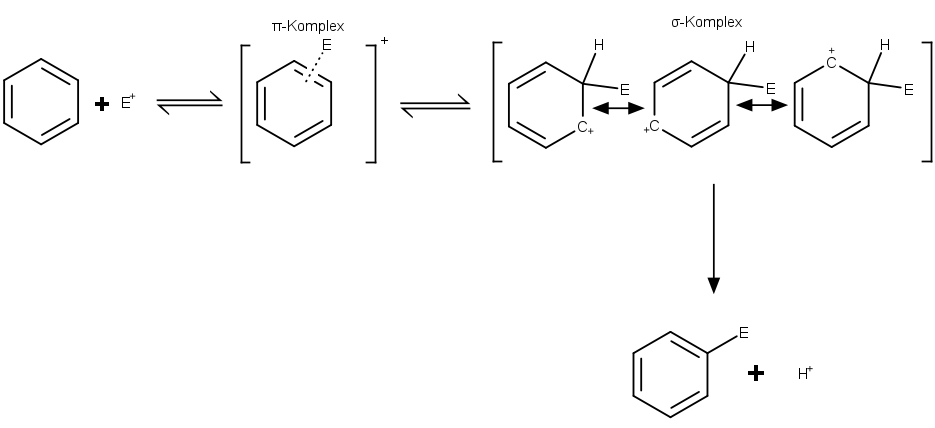
    <figcaption>schematischer Ablauf der elektrophilen aromatischen Substitution</figcaption>
</figure>

### Halogenierung

Bei der Halogenierung wird das Halogen zuerst durch den Katalysator (z.B. AlCl3) aktiviert. Das dadurch entstehende Halogenid fungiert dann als Elektrophil.

<figure>
    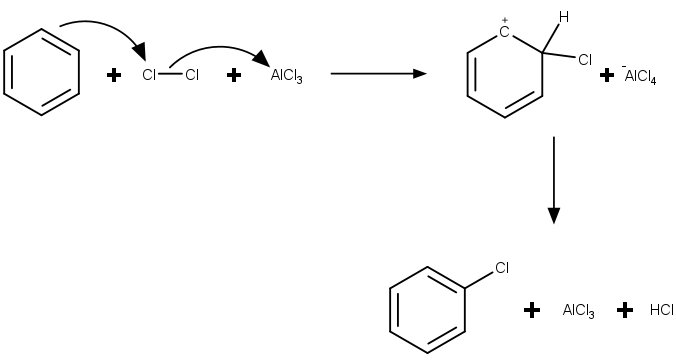
    <figcaption></figcaption>
</figure>

### Nitrierung

Bei der Nitrierung wird ein Wasserstoff mit einem Nitronium-Ion (NO2+) substituert, das hoch reaktiv ist und meist *in situ* (während der Reaktion) hergestellt.

<Formulae> H_2SO_4 \; + \; HNO_3 \; \rightarrow \; HSO_4^- \; + \; H_2NO_3 </Formulae>
<Formulae> H_2NO_3 \; \rightarrow \; H_2O \; + \; NO_2^+ </Formulae>

<figure>
    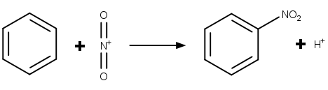
    <figcaption></figcaption>
</figure>

### Sulfonierung

<figure>
    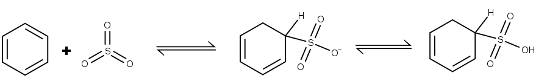
    <figcaption></figcaption>
</figure>

### Friedel-Crafts-Reaktionen

Bei den Friedel-Crafts-Reaktionen wird ein Halogenalkan bzw. ein Acyliumhalogenid durch das entsprechende Aluminiumhalogenid aktiviert, indem das Halogen abgespalten wird.

<figure>
    
    <figcaption>Friedel-Crafts-Alkylierung</figcaption>
</figure>

<figure>
    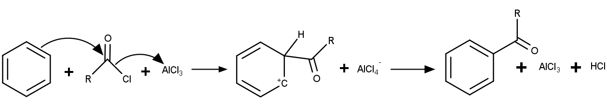
    <figcaption>Friedel-Crafts-Acylierung</figcaption>
</figure>

## Nucleophile Substitution (SN)

Bei einem nucleophilen Angriff auf ein positiviertes Kohlenstoffatom wird die Abgangsgruppe Y durch das Nucleophil X- ersetzt.

<figure>
    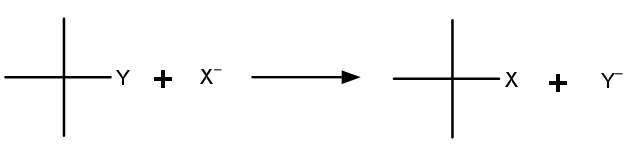
    <figcaption>allgemeine Reaktionsgleichung einer nucleophilen Substitution</figcaption>
</figure>

### monomolekulare nucleophile Substitution (SN1)

Bei einer SN1-Reaktion dissoziiert die C-Y-Bindung im Lösungsmittel, wodurch ein positiv geladenes Carbenium-Ion entsteht, an das das Nucleophil angreifen kann. Dieser Schritt ist der langsamste in der Kette und damit geschwindigkeitsbestimmend. Deswegen ist die Reaktionsgeschwindigkeit nur von der Konzentration dieses Moleküls abhängig (Reaktion 1. Ordnung).

<Formulae> v = k * c </Formulae>

SN1-Reaktionen laufen vor allem in polar-protischen Lösungsmitteln ab. Günstig ist außerdem, wenn das entstehende Carbenium-Ion möglichst stabil ist (tert > sek > prim).

<figure>
    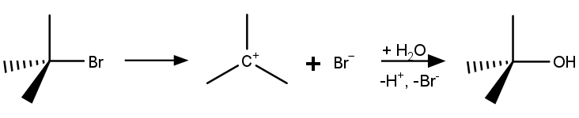
    <Formulae> v = k * c_{tert-Butylbromid} </Formulae>
    <figcaption>nucleophile Substitution von Brom durch eine Hydroxy-Gruppe an tert-Butylbromid</figcaption>
</figure>

Da bei diesem Reaktionsmechanismus zuerst das Carbenium-Ion entsteht, gibt es keine Kontrolle, auf welcher Seite das Nucleophil gebunden wird. Dadurch sind bei einer SN1-Substitution an einem chiralen Kohlenstoff **Retention und Inversion** gleich häufig und es kommt zur Racemisierung.

<figure>
    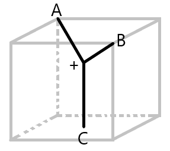
    <figcaption>Das Nucleophil kann an beiden Seiten angreifen, egal, wo vorher die Abgangsgruppe war.</figcaption>
</figure>

### bimolekulare nucleophile Substitution (SN2)

Bei der SN2-Reaktion greift das Nucleophil gegenüber der Abgangsgruppe an, wobei ein Übergangszustand entsteht, bevor die Abgangsgruppe abgespalten wird. Da im ersten Schritt das Ausgangsmolekül und auch das Nucleophil vorhanden sein müssen, hängt die Reaktionsgeschwindigkeit von zwei Molekülen ab (Reaktion 2. Ordnung).

<Formulae> v = k * c_1 * c_2 </Formulae>

SN2-Reaktionen laufen bevorzugt in polar aprotischen Lösungsmitteln ab, wenn das betreffende Carbenium-Ion instabil wäre (also eher an primären oder sekundären Kohlenstoffen als an tertiären).

<figure>
    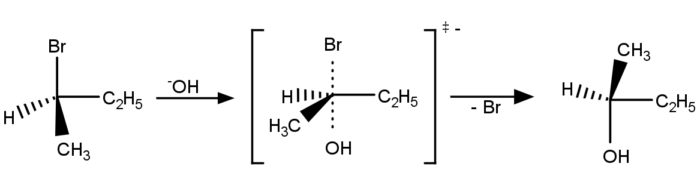
    <Formulae> v = k * c_{R-2-Brombutan} * c_{OH^-} </Formulae>
    <figcaption>nucleophile Substitution von Brom durch eine Hydroxid-Gruppe an R-2-Brombutan</figcaption>
</figure>

Wenn das Kohlenstoff-Atom am Ausgangsmolekül chiral ist, wird wird die Absolutkonfiguration invertiert (**Walden-Umkehr**). Um ein Produkt mit der gleichen Chiralität zu erhalten (z.B. in biologischen Systemen) wird die Reaktion in zwei Teilschritten durchgeführt, um durch zweifache Walden-Umkehr ein Molekül mit der gleichen Absolutkonfiguration zu erhalten.

<figure>
    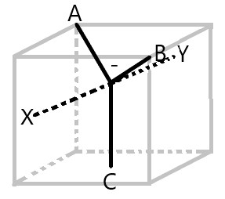
    <figcaption>Das Nucleophil greift am leeren antibindenden Molekülorbital, gegenüber der Abgangsgruppe an. Dadurch sind die Molekülorbitale der Bindung zur Abgangsgruppe voll besetzt (Bindungsordnung = 0), die Bindung wird gelöst.</figcaption>
</figure>

### Reaktionsenergien

<figure>
    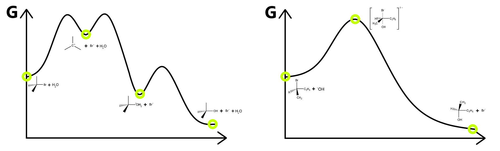
    <figcaption>Verlauf der freien Enthalpie G während der Reaktion (links: SN1; rechts: SN2)</figcaption>
</figure>
