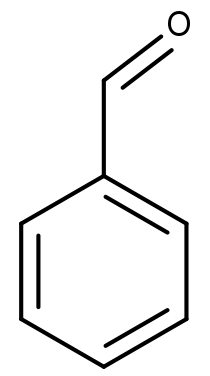
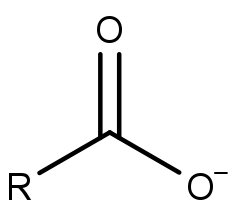
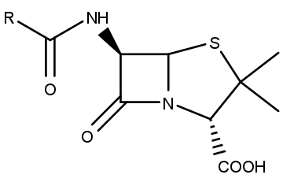

# Sauerstoff- und stickstoffhaltige Kohlenwasserstoffe

Sauerstoffhaltige Kohlenwasserstoffe wie Alkohole entstehen (formal) durch die Oxidation von Alkanen. Für primäre Kohlenstoffatome geht die Reihe vom Alkan über den primären Alkohol und das Aldehyd bis zu Kohlensäure. Ameisensäure (aus Methan) kann noch zu CO2 weiter oxidiert werden.

<figure>
    
    <figcaption>Oxidationsreihe von Methan bis Kohlenstoffdioxid</figcaption>
</figure>

Für sekundäre Kohlenstoffe endet die Reihe nach dem sekundären Alkohol am Keton.

<figure>
    
    <figcaption>Oxidationsreihe eines sekundären Kohlenstoffatoms</figcaption>
</figure>

## Alkohole

Bei Alkoholen ist ein Wasserstoffatom durch eine Hydroxy-Gruppe ersetzt. Die Substitution an einem primären Kohlenstoff führt zu einem primären Alkohol, an einem sekundären Kohlenstoff entsteht ein sekundärer Alkohol sowie am tertiären Kohlenstoff ein tertiärer Alkohol. Durch Deprotonierung eines Alkohols entsteht ein **Alkoholat**-Ion.

<figure>
    
    <figcaption></figcaption>
</figure>

<figure>
    
    <figcaption>Herstellung von Alkoholat mithilfe von metallischem Natrium. Dabei entstehen Natrium-Ionen und Wasserstoffgas.</figcaption>
</figure>

**Phenole** sind Alkohole mit einer aromatischen Restgruppe. Aus einem deprotonierten Phenol entsteht ein Phenolat-Ion. Phenole sind generell leichter deprotonierbar als andere Alkohole, weshalb sie stärkere Säuren sind. Der Grund dafür liegt in der Mesomerie. Die negative Ladung am Phenolat stellt ein weiteres freies Elektronenpaar bereit, das für die Mesomeriestabilisierung verwendet werden kann.

<figure>
    <Formulae> pK_{S \; Ethanol} = 17,5 </Formulae>
    <Formulae> pK_{S \; Phenol} = 10 </Formulae>
    <figcaption></figcaption>
</figure>

## Ether

Ether bestehen aus zwei Alkylen, die über einen Sauerstoff verbunden sind. Ether sind und unpolar und reaktionsträge. Durch sterische Hinderung bilden höhere Ether zunehmend schlechter Wasserstoffbrücken aus, weshalb der generell niedrige Siedepunkt mit der Kettenlänge weiter abnimmt. Deshalb können sie sich bei Raumtemperatur in der Luft anreichern. Ether werden oft als Lösungsmittel verwendet. Allerdings bilden sie bei längerer Lagerung explosive Peroxide.

<figure>
    
    <figcaption></figcaption>
</figure>

**Beispiele:**

<table class="gallery-table">
    <tbody>
        <tr>
            <td>
                <figure>
                    
                    <figcaption>Diethylether</figcaption>
                </figure>
            </td>
            <td>
                <figure>
                    
                    <figcaption>Tetrahydrofuran</figcaption>
                </figure>
            </td>
            <td>
                <figure>
                    
                    <figcaption>1,4-Dioxan</figcaption>
                </figure>
            </td>
            <td>
                <figure>
                    
                    <figcaption>1-Ethoxyethan-1-peroxol</figcaption>
                </figure>
            </td>
        </tr>
    </tbody>
</table>

### Williamsonsche Ethersynthese

Die Williamsonsche Ethersynthese ist eine nucleophile Substitution an einem Halogenalkan durch ein Alkoholat-Ion.

<figure>
    
    <figcaption></figcaption>
</figure>

## Aldehyde und Ketone

Ketone haben eine Carbonylgruppe mit zwei organischen Resten. Bei Aldehyden ist einer der Reste (bei Formaldehyd/Methanal beide) einfach ein Wasserstoff.

<figure>
    
    <figcaption>allgemeine Struktur der Aldehyde (R' = H) und Ketone</figcaption>
</figure>

### Nomenklatur

An den Stammnamen des zugrundeliegenden Alkans wird die Positionsziffer der Carbonylgruppe mit der Endung -on (Ketone) bzw. -al (Aldehyde) angehängt. Wenn die Carbonylgruppe nicht die höchste Priorität aller funktionellen Gruppen im Molekül hat, wird stattdessen das Präfix oxo- für Ketone wie auch für Aldehyde verwendet. Daneben haben wichtige Aldehyde und Ketone oft gebräuchliche Trivialnamen.

<table class="gallery-table">
    <tbody>
        <tr>
            <td>
                <figure>
                    
                    <figcaption>Methanal   (Formaldehyd)</figcaption>
                </figure>
            </td>
            <td>
                <figure>
                    
                    <figcaption>Ethanal   (Acetaldehyd)</figcaption>
                </figure>
            </td>
            <td>
                <figure>
                    
                    <figcaption>Propan-2-on   (Aceton)</figcaption>
                </figure>
            </td>
            <td>
                <figure>
                    
                    <figcaption>2-Oxobutansäure</figcaption>
                </figure>
            </td>
            <td>
                <figure>
                    
                    <figcaption>Benzaldehyd</figcaption>
                </figure>
            </td>
            <td>
                <figure>
                    
                    <figcaption>Cyclohexanon</figcaption>
                </figure>
            </td>
            <td>
                <figure>
                    
                    <figcaption>Acetophenon</figcaption>
                </figure>
            </td>
        </tr>
    </tbody>
</table>

### Eigenschaften der Carbonylgruppe

Aldehyde und Ketone haben niedriege Siedepunkte. Die Verbindungen liegen planar um das Kohlenstoffatom. Durch die Elektronegativitätsdifferenz enthsteht zwischen Kohlenstoff und Sauerstoff ein Dipol, wodurch das Kohlenstoffatom als Elektrophil agieren kann. Die Verbdindung zum Sauerstoff bildet eine mesomere Struktur.

<figure>
    
    <figcaption>Mesomerie der Carbonylgruppe</figcaption>
</figure>

So wie Aldehyde und Ketone aus primären bzw. sekundären Alkoholen oxidiert werden können, können diese wieder zu einem Alkohol reduziert werden. Der Kohlenstoff an der $\alpha$-Position ist in Anwesenheit einer Base leicht deprotonierbar, weshalb Aldehyde und Ketone als Säuren reagieren.

<figure>
    
    <figcaption>Deprotonierung eines Ketons an der α-Position</figcaption>
</figure>

Durch Deprotonierung am $\alpha$-Kohlenstoffatom entsteht ein **Enolat-Ion**. Das verstärkt die Mesomerie des Moleküls, was die Deprotonierung begünstigt und erleichtert.

<figure>
    
    <figcaption>Mesomerie des Enolat-Ions</figcaption>
</figure>

### Reaktivität

Aldehyde und Ketone können als Elektrophil agieren. Diese Reaktion muss allerdings durch eine Säure oder Base katalysiert werden.

**Säurekatalyse:**

Die Säure aktiviert das Elektrophil (die Carbonylgruppe), indem sie den Sauerstoff protoniert. Danach greift das Nucleophil an das Kohlenstoffatom an.

<figure>
    
    <figcaption></figcaption>
</figure>

**Basenkatalyse:**

Bei der Basenkatalyse wird zuerst das Nucleophil durch Deprotonierung aktiviert, bevor es das Kohlenstoffatom angreift.

<figure>
    <Formulae> HNu \; + \; Base^- \; \rightarrow \; Nu^- \; + \; HBase </Formulae>
    <figcaption>Aktivierung des Nucleophils durch eine Base</figcaption>
</figure>

<figure>
    
    <figcaption></figcaption>
</figure>

#### Hydrate

Hydrate oder **geminale Diole** entstehen durch die Addition von Wasser an eine Carbonylgruppe.

<figure>
    
    <figcaption>Bildung von Chloralhydrat aus Chloral</figcaption>
</figure>

#### Acetale

Durch die Addition von Alkoholen entstehen zunächst **Halbacetale** und in einer zweiten Addition **Vollacetale**. Diese werden in der Synthesechemie als Schutzgruppen verwendet, da sie die Reaktivität der Carbonylgruppe "maskieren", aber unter gegebenen Bedingungen gezielt umgekehrt werden können.

<figure>
    
    <figcaption>Bildung eines Halbacetals</figcaption>
</figure>

<figure>
    
    <figcaption>Bildung eines Vollacetals</figcaption>
</figure>

#### Cyanhydrine

Cyanhydrine können aus Aldehyden und Ketonen durch Addition von Blausäure hergestellt werden.

<figure>
    
    <figcaption></figcaption>
</figure>

#### Alkohole

Durch die Addition von Grignard-Verbindungen können primäre (aus Methanal), sekundäre (aus Aldehyden allgemein) oder tertiäre Alkohole (aus Ketonen) hergestellt werden.

<figure>
    
    <figcaption>Reduktion mittels einer Grignard-Verbindung</figcaption>
</figure>

Primäre oder sekundäre Alkohole können auch durch Addition eines Hydrid-Ions aus Aldehyden und Ketonen reduziert werden. Quelle des Hydrids können z.B. Lithiumaluminiumhydrid oder Natriumborhydrid sein.

<figure>
    
    <figcaption></figcaption>
</figure>

#### Aldole

Aldole entstehen aus einem Enolat-Ion und einem weiteren Keton oder Aldehyd.

**Aldoladdition:**

<figure>
    
    <figcaption></figcaption>
</figure>

**Aldolkondensation:**

Nach einer Aldoladdition kann noch ein Wassermolekülabgespalten werden, wenn dadurch eine konjugierte Doppelbindung entsteht, da diese die Mesomerie verstärkt und damit energetisch begünstigt ist.

<figure>
    
    <figcaption></figcaption>
</figure>

## Carbonsäuren

Carbonsäuren haben eine endständige Carboxylgruppe. Diese kann gut Wasserstoffbrücken mit einer anderen Carboxylgruppe ausbilden, weshalb Carbonsäuren hohe Siedepunkte haben.

<figure>
    
    <figcaption>Wassterstoffbrücken zwischen zwei Carbonsäuren</figcaption>
</figure>

Wie der Name schon sagt, agieren Carbonsäuren als Säuren und geben Protonen ab. Dadurch entstehen **Carboxylate**.

<figure>
    
    <figcaption>Carboxylat-Ion</figcaption>
</figure>

### Nomenklatur

Grundsätzlich wird an den Namen einer Carbonsäure einfach das Wort -(carbon)säure angehängt. Oft existieren aber auch Trivialnamen, die häufige Anwendung finden.

<table class="gallery-table">
    <tbody>
        <tr>
            <td>
                <figure>
                    
                    <figcaption>Methansäure   (Ameisensäure)</figcaption>
                </figure>
            </td>
            <td>
                <figure>
                    
                    <figcaption>Ethansäure   (Essigsäure)</figcaption>
                </figure>
            </td>
            <td>
                <figure>
                    
                    <figcaption>Propensäure   (Acrylsäure)</figcaption>
                </figure>
            </td>
            <td>
                <figure>
                    
                    <figcaption>Benzencarbonsäure   (Benzoesäure)</figcaption>
                </figure>
            </td>
        </tr>
    </tbody>
</table>

### Reaktivität

Durch die beiden Sauerstoffe mit ihren freien Elektronenpaaren kommt es zu einer mesomeren Stabilisierung mit einer geringen Partialladung am Kohlenstoff, wodurch kein Carbenium-Ion entsteht. Deswegen sind Carbonsäuren grundsätzlich reaktionsträge. Dafür haben sie eine hohe Acidität, da das Carboxylat-Ion besonders gut durch die Resonanz stabilisiert wird.

<figure>
    
    <figcaption>Mesomerie einer Carbonsäure</figcaption>
</figure>

<figure>
    
    <figcaption>Mesomerie eines Carboxylat-Ions</figcaption>
</figure>

### Herstellung

Carbonsäuren können zum Beispiel mit Kaliumpermanganat als Katalysator aus primären Alkoholen oder Aldehyden hergestellt werden.

<Formulae> R-CH_2-OH \; \stackrel {KMnO_4} {\rightarrow} \; R-COOH </Formulae>

Eine weitere Möglichkeit ist die Reaktion zwischen einer Grignard-Verbindung und Kohlenstoffdioxid.

<figure>
    
    <figcaption></figcaption>
</figure>

Ein dritter Weg ist die Hydrolyse von Nitrilen unter sauren oder basischen Bedingungen.

<figure>
    
    <figcaption></figcaption>
</figure>

### Carbonsäurederivate

Carbonsäurederivate entstehen formal durch Ersetzen der Hydroxygruppe durch ein Nucleophil. Dadurch entstehen Säurehalogenide, Anhydride, Ester oder Amide. Säurehalogenide und Anhydride haben durch die Elektronegativitätsdifferenz eine positive Partialladung am Kohlenstoffatom der Carboxylgruppe, weshalb sie sehr reaktiv sind. Ester und Amide sind dagegen ähnlich wie Carbonäuren durch Mesomerie stabilisiert und dadurch eher reaktionsträge.

<figure>
    <Formulae> Säurechlorid > Anhydrid > Ester > Carbonsäure > Amid > Carboxylat </Formulae>
    <figcaption>Reaktivitäten der Carbonsäurederivate</figcaption>
</figure>

#### nucleophile Acylsubstitution

Die Bildung von Carbonsäurederivaten basiert auf der nucleophilen Acylsubstitution, bei der das Nucleophil am Kohlenstoffatom angreift, wodurch die Doppelbindung zum Sauerstoff gebrochen wird. Im nächsten Schritt wird diese neu gebildet. Wenn der alte Substituent eine bessere Abgangsgruppe ist, wird er dabei abgespalten und das Nucleophil übernimmt seinen Platz.

<figure>
    
    <figcaption>Acylsubstitution mit negativem Nucleophil</figcaption>
</figure>

<figure>
    
    <figcaption>Acylsubstitution mit neutralem Nucleophil</figcaption>
</figure>

#### Carbonsäurehalogenide

Carbonsäurehalogenide enden entsprechend ihrem Halogen mit dem Namen des entsprechenden Halogenid-Ions (Cl -> -chlorid, Br -> -bromid, ...). Sie werden aus einer Carbonsäure und z.B. Thionylchlorid gebildet.

<Formulae> R-COOH \; \stackrel {SOCl_2} \rightarrow \; R-COCl </Formulae>

Aus Säurehalogeniden können Ester und Amide hergestellt werden.

<figure>
    
    <figcaption>Reaktion mit einem primären Alkohol zu einem Ester</figcaption>
</figure>

<figure>
    
    <figcaption>Reaktion mit einem Amin zu einem Amid</figcaption>
</figure>

#### Carbonsäureanhydride

Aus zwei Carbonsäuren entsteht unter Abspaltung von Wasser ein Carbonsäureanhydrid.

<figure>
    
    <figcaption></figcaption>
</figure>

Aus Dicarbonsäuren können auch cyclische Anhydride entstehen (bzw. umgekehrt).

<figure>
    
    <figcaption>Maleinsäureanhydrid</figcaption>
</figure>

Durch die Reaktion mit einem Alkohol kann ein Anhydrid in einen Ester und eine Carbonsäure gespalten werden.

<figure>
    
    <figcaption></figcaption>
</figure>

## Ester

**Carbonsäureester** entstehen formal, unter sauren Bedingungen und durch Abspaltung von Wasser (=> Kondensationsreaktion), aus einer Carbonsäure und einem Alkohol.

<figure>
    
    <figcaption></figcaption>
</figure>

Schwefelsäure und Phosphorsäure haben zwei bzw. drei Hydroxygruppen, weshalb sie auch mehr Alkohole aufnehmen können. Dadurch entstehen **Schwefel- und Phosphorsäureester**.

<figure>
    
    <figcaption>Schwefelsäureester</figcaption>
</figure>

<figure>
    
    <figcaption>Phosphorsäureester</figcaption>
</figure>

### Nomenklatur

Eine vor allem im deutschen Sprachraum gebräuchliche Bennenungsmethode für Carbonsäureester geht von der Säure aus und hängt daran den Namen des Alkyls, das aus dem Alkohol entsteht, sowie die Endung -ester an. International wird eher die Variante verwendet, bei der auf den Namen des Alkyls der Name des Carboxylat-Ions folgt.

<figure>
    
    <figcaption>Ameisensäurepropylester/Propylformiat</figcaption>
</figure>

### Reaktionsmechanismus der Synthese

<figure>
    
    <figcaption></figcaption>
</figure>

Der Sauerstoff, der zuvor über die Doppelbindung mit dem Kohlenstoff verbunden war, wird abgespalten. Der Sauerstoff der Hydroxygruppe bildet die neue Doppelbindung, während die Verbindung zum Alkylrest über den Sauerstoff des Alkohols hergestellt wird. Eine Ausnahme sind zum Beispiel tert-Butylester, bei deren Bildung der Alkohol statt der Carbonsäure (tert-Butanol) durch das Proton aktiviert wird. Dadurch entsteht ein tertiäres Carbenium-Ion, an dem die Hydroxygruppe der Carbonsäure als Nucleophil angreift. Deswegen bleibt die Doppelbindung am Carbonyl erhalten und die Verbindung entsteht über das Sauerstoffatom der Carbonsäure.

<figure>
    
    <figcaption>Aktivierung von tert-Butanol</figcaption>
</figure>

Daneben können Ester auch aus Säurechloriden oder Anhydriden durch Acylsubstitution mit einem Alkohol oder Alkoholat hergestellt werden.

### Cyclische Ester (Lactone)

Lactone entstehen durch intramolekulare Veresterung. Die Benennung erfolgt nach der Größe des Rings. Vorne an das Wort Lacton wird die Bezeichnung des Kohlenstoffatoms angehängt, an dem vor der Veresterung die Alkoholgruppe hing ($\alpha, \beta, \gamma, \delta, ...$).

<figure>
    
    <figcaption>γ-Lacton</figcaption>
</figure>

<figure>
    
    <figcaption>δ-Lacton</figcaption>
</figure>

Cyclische Ester können auch aromatische Systeme bilden.

<figure>
    
    <figcaption>Cumarin</figcaption>
</figure>

### Reaktionen

Wie Carbonäuren können auch Ester mit Aminen zu Amiden reagieren.

<figure>
    
    <figcaption></figcaption>
</figure>

#### Umesterung

Bei der Umesterung tauscht ein Ester seinen Rest am Sauerstoff mit einem Alkohol.

<figure>
    
    <figcaption></figcaption>
</figure>

#### Verseifung

Die Verseifung ist die Hydrolyse eines Esters unter basischen Bedingungen, wobei ein Alkohol und ein Carboxylat entstehen. Eine ähnliche Reaktion kann auch unter sauren Bedingungen ablaufen, allerdings mit einer Carbonsäure statt eines Carboxylats als Produkt. Die Verseifung ist im Gegensatz zur sauren Hydrolyse im letzten Schritt nicht umkehrbar.

<figure>
    
    <figcaption></figcaption>
</figure>

#### Reduktion

Ester können mit einem Hydrid-Ion (z.B. von Aluminiumhydrid) zu Alkoholen reduziert werden. Dabei entsteht als Zwischenprodukt ein Aldehyd.

<figure>
    
    <figcaption></figcaption>
</figure>

### Neutralfette

Neutralfette sind Triester von Glycerol (Triglyceride) mit drei **Fettsäuren** (unverzweigte aliphatische Monocarbonsäuren mit gerader Kohlenstoffanzahl, gesättigt oder ungesättigt). Sie können durch Verseifung mit z.B. Natriumhydroxid aufgespalten werden, wobei man Glycerol und die Natriumsalze der drei Fettsäuren erhält. Diese sind amphipathisch, haben also ein polares und ein unpolares Ende. Dadurch können sie **Micellen** um unpolare (Schmutz-)Partikel bilden und diese auch in einem polaren Lösungsmittel wie Wasser lösen.

<figure>
    
    <figcaption></figcaption>
</figure>

<figure>
    
    <figcaption>Micelle</figcaption>
</figure>

## Amide

Carbonsäureamide ähneln den Carbonsäureestern. Anders als bei diesen haben Amide einen Stickstoff als Verbindung zwischen den organischen Resten, wobei der zweite Rest auch ein Wasserstoff sein kann.

<figure>
    
    <figcaption></figcaption>
</figure>

<table class="gallery-table">
    <tbody>
        <tr>
            <td>
                <figure>
                    
                    <figcaption>Acetamid</figcaption>
                </figure>
            </td>
            <td>
                <figure>
                    
                    <figcaption>Benzamid</figcaption>
                </figure>
            </td>
            <td>
                <figure>
                    
                    <figcaption>Diacetamid</figcaption>
                </figure>
            </td>
            <td>
                <figure>
                    
                    <figcaption>Dimethylformamid</figcaption>
                </figure>
            </td>
        </tr>
    </tbody>
</table>

Amide sind bei Raumtemperatur meist fest. Eine Ausnahme ist zum Beispiel Dimethylformamid, welches als Lösungsmittel eingesetzt wird. Sie sind durch Mesomerie stabilisiert und deshalb unreaktiv und schlechte Nucleophile.

<figure>
    
    <figcaption></figcaption>
</figure>

### cyclische Amide (Lactame)

Die Benennung von Lactamen erfolgt analog zu den Lactonen der Ester. Wichtige $\beta$-Lactame sind zum Beispiel Penicilline.

<figure>
    
    <figcaption>allgemeine Formel der Penicilline</figcaption>
</figure>

## Amine

Amine bestehen aus einem Stickstoffatom, das an drei organische Reste bzw. Wasserstoffatome gebunden ist. Diese Verbindungen sind generell basisch und durch die negative Partialladung am Stickstoff gut Nucleophile.

<table class="gallery-table">
    <tbody>
        <tr>
            <td>
                <figure>
                    
                    <figcaption>Ammoniak</figcaption>
                </figure>
            </td>
            <td>
                <figure>
                    
                    <figcaption>primäres Amin</figcaption>
                </figure>
            </td>
            <td>
                <figure>
                    
                    <figcaption>sekundäres Amin</figcaption>
                </figure>
            </td>
            <td>
                <figure>
                    
                    <figcaption>tertiäres Amin</figcaption>
                </figure>
            </td>
        </tr>
    </tbody>
</table>

### Synthese

Amine können aus Ammoniak und einem Halogenalkan synthetisiert werden. Allerdings kann das entstehende primäre Amin wegen seines freien Elektronenpaares weiter mit einem Halogenalkan reagieren, bis ein tertiäres Amin erreicht ist. Deswegen ist diese Art der Synthese nicht selektiv und ungeeignet, um primäre oder sekundäre Amine herzustellen.

<figure>
    
    <figcaption></figcaption>
</figure>

Bei der **Gabriel-Synthese** reagiert das Halogenalkan nicht mit Ammoniak, sondern mit Kaliumphtalimid. Das erwünschte primäre Amin wird dann mithilfe von Hydrazin abgespalten.

<figure>
    
    <figcaption></figcaption>
</figure>

### Reaktionen

Amine können gemeinsam mit Säurehalogeniden, Anhydriden oder Estern Amide bilden.

<figure>
    
    <figcaption>Y ist ein Halogenid (Säurehalogenid), Alkoholat (Ester) oder Carboxylat (Anhydrid)</figcaption>
</figure>

### Imine und Enamine

Durch Addition von primären bzw. sekundären Aminen an Aldehyde oder Ketone können Imine bzw. Enamine gewonnen werden.

<figure>
    
    <figcaption>Imin-Synthese mit einem primären Amin</figcaption>
</figure>

<figure>
    
    <figcaption>Enamin-Synthese mit einem sekundären Amin</figcaption>
</figure>

### Hofmann-Eliminierung

Mit Iodmethan und der Base von Silber(I)-Oxid können aus bestimmten Aminen Alkene erzeugt werden.

<figure>
    
    <figcaption></figcaption>
</figure>
