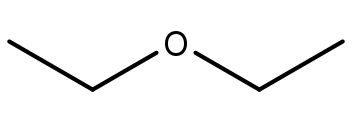

# Sauerstoff- und stickstoffhaltige Kohlenwasserstoffe

Sauerstoffhaltige Kohlenwasserstoffe wie Alkohole entstehen (formal) durch die Oxidation von Alkanen. Für primäre Kohlenstoffatome geht die Reihe vom Alkan über den primären Alkohol und das Aldehyd bis zu Kohlensäure. Ameisensäure (aus Methan) kann noch zu CO2 weiter oxidiert werden.

<figure>
    
    <figcaption>Oxidationsreihe von Methan bis Kohlenstoffdioxid</figcaption>
</figure>

Für sekundäre Kohlenstoffe endet die Reihe nach dem sekundären Alkohol am Keton.

<figure>
    
    <figcaption>Oxidationsreihe eines sekundären Kohlenstoffatoms</figcaption>
</figure>

## Alkohole

Bei Alkoholen ist ein Wasserstoffatom durch eine Hydroxy-Gruppe ersetzt. Die Substitution an einem primären Kohlenstoff führt zu einem primären Alkohol, an einem sekundären Kohlenstoff entsteht ein sekundärer Alkohol sowie am tertiären Kohlenstoff ein tertiärer Alkohol. Durch Deprotonierung eines Alkohols entsteht ein **Alkoholat**-Ion.

<figure>
    
    <figcaption></figcaption>
</figure>

<figure>
    
    <figcaption>Herstellung von Alkoholat mithilfe von metallischem Natrium. Dabei entstehen Natrium-Ionen und Wasserstoffgas.</figcaption>
</figure>

**Phenole** sind Alkohole mit einer aromatischen Restgruppe. Aus einem deprotonierten Phenol entsteht ein Phenolat-Ion. Phenole sind generell leichter deprotonierbar als andere Alkohole, weshalb sie stärkere Säuren sind. Der Grund dafür liegt in der Mesomerie. Die negative Ladung am Phenolat stellt ein weiteres freies Elektronenpaar bereit, das für die Mesomeriestabilisierung verwendet werden kann.

<figure>
    <Formulae> pK_{S \; Ethanol} = 17,5 </Formulae>
    <Formulae> pK_{S \; Phenol} = 10 </Formulae>
    <figcaption></figcaption>
</figure>

## Ether

Ether bestehen aus zwei Alkylen, die über einen Sauerstoff verbunden sind. Ether sind und unpolar und reaktionsträge. Durch sterische Hinderung bilden höhere Ether zunehmend schlechter Wasserstoffbrücken aus, weshalb der generell niedrige Siedepunkt mit der Kettenlänge weiter abnimmt. Deshalb können sie sich bei Raumtemperatur in der Luft anreichern. Ether werden oft als Lösungsmittel verwendet. Allerdings bilden sie bei längerer Lagerung explosive Peroxide.

<figure>
    
    <figcaption></figcaption>
</figure>

**Beispiele:**

<table class="gallery-table">
    <tbody>
        <tr>
            <td>
                <figure>
                    
                    <figcaption>Diethylether</figcaption>
                </figure>
            </td>
            <td>
                <figure>
                    
                    <figcaption>Tetrahydrofuran</figcaption>
                </figure>
            </td>
            <td>
                <figure>
                    
                    <figcaption>1,4-Dioxan</figcaption>
                </figure>
            </td>
            <td>
                <figure>
                    
                    <figcaption>1-Ethoxyethan-1-peroxol</figcaption>
                </figure>
            </td>
        </tr>
    </tbody>
</table>

### Williamsonsche Ethersynthese

Die Williamsonsche Ethersynthese ist eine nucleophile Substitution an einem Halogenalkan durch ein Alkoholat-Ion.

<figure>
    
    <figcaption></figcaption>
</figure>
