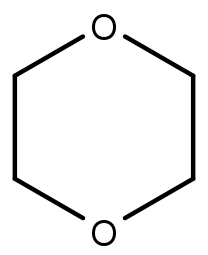

# Sauerstoff- und stickstoffhaltige Kohlenwasserstoffe

Sauerstoffhaltige Kohlenwasserstoffe wie Alkohole entstehen (formal) durch die Oxidation von Alkanen. Für primäre Kohlenstoffatome geht die Reihe vom Alkan über den primären Alkohol und das Aldehyd bis zu Kohlensäure. Ameisensäure (aus Methan) kann noch zu CO2 weiter oxidiert werden.

<figure>
    
    <figcaption>Oxidationsreihe von Methan bis Kohlenstoffdioxid</figcaption>
</figure>

Für sekundäre Kohlenstoffe endet die Reihe nach dem sekundären Alkohol am Keton.

<figure>
    
    <figcaption>Oxidationsreihe eines sekundären Kohlenstoffatoms</figcaption>
</figure>

## Alkohole

Bei Alkoholen ist ein Wasserstoffatom durch eine Hydroxy-Gruppe ersetzt. Die Substitution an einem primären Kohlenstoff führt zu einem primären Alkohol, an einem sekundären Kohlenstoff entsteht ein sekundärer Alkohol sowie am tertiären Kohlenstoff ein tertiärer Alkohol. Durch Deprotonierung eines Alkohols entsteht ein **Alkoholat**-Ion.

<figure>
    
    <figcaption></figcaption>
</figure>

<figure>
    
    <figcaption>Herstellung von Alkoholat mithilfe von metallischem Natrium. Dabei entstehen Natrium-Ionen und Wasserstoffgas.</figcaption>
</figure>

**Phenole** sind Alkohole mit einer aromatischen Restgruppe. Aus einem deprotonierten Phenol entsteht ein Phenolat-Ion. Phenole sind generell leichter deprotonierbar als andere Alkohole, weshalb sie stärkere Säuren sind. Der Grund dafür liegt in der Mesomerie. Die negative Ladung am Phenolat stellt ein weiteres freies Elektronenpaar bereit, das für die Mesomeriestabilisierung verwendet werden kann.

<figure>
    <Formulae> pK_{S \; Ethanol} = 17,5 </Formulae>
    <Formulae> pK_{S \; Phenol} = 10 </Formulae>
    <figcaption></figcaption>
</figure>

## Ether

Ether bestehen aus zwei Alkylen, die über einen Sauerstoff verbunden sind. Ether sind und unpolar und reaktionsträge. Durch sterische Hinderung bilden höhere Ether zunehmend schlechter Wasserstoffbrücken aus, weshalb der generell niedrige Siedepunkt mit der Kettenlänge weiter abnimmt. Deshalb können sie sich bei Raumtemperatur in der Luft anreichern. Ether werden oft als Lösungsmittel verwendet. Allerdings bilden sie bei längerer Lagerung explosive Peroxide.

<figure>
    
    <figcaption></figcaption>
</figure>

**Beispiele:**

<table class="gallery-table">
    <tbody>
        <tr>
            <td>
                <figure>
                    
                    <figcaption>Diethylether</figcaption>
                </figure>
            </td>
            <td>
                <figure>
                    
                    <figcaption>Tetrahydrofuran</figcaption>
                </figure>
            </td>
            <td>
                <figure>
                    
                    <figcaption>1,4-Dioxan</figcaption>
                </figure>
            </td>
            <td>
                <figure>
                    
                    <figcaption>1-Ethoxyethan-1-peroxol</figcaption>
                </figure>
            </td>
        </tr>
    </tbody>
</table>

### Williamsonsche Ethersynthese

Die Williamsonsche Ethersynthese ist eine nucleophile Substitution an einem Halogenalkan durch ein Alkoholat-Ion.

<figure>
    
    <figcaption></figcaption>
</figure>

## Aldehyde und Ketone

Ketone haben eine Carbonylgruppe mit zwei organischen Resten. Bei Aldehyden ist einer der Reste (bei Formaldehyd/Methanal beide) einfach ein Wasserstoff.

<figure>
    
    <figcaption>allgemeine Struktur der Aldehyde (R' = H) und Ketone</figcaption>
</figure>

### Nomenklatur

An den Stammnamen des zugrundeliegenden Alkans wird die Positionsziffer der Carbonylgruppe mit der Endung -on (Ketone) bzw. -al (Aldehyde) angehängt. Wenn die Carbonylgruppe nicht die höchste Priorität aller funktionellen Gruppen im Molekül hat, wird stattdessen das Präfix oxo- für Ketone wie auch für Aldehyde verwendet. Daneben haben wichtige Aldehyde und Ketone oft gebräuchliche Trivialnamen.

<table class="gallery-table">
    <tbody>
        <tr>
            <td>
                <figure>
                    
                    <figcaption>Methanal   (Formaldehyd)</figcaption>
                </figure>
            </td>
            <td>
                <figure>
                    
                    <figcaption>Ethana   (Acetaldehyd)</figcaption>
                </figure>
            </td>
            <td>
                <figure>
                    
                    <figcaption>Propan-2-on   (Aceton)</figcaption>
                </figure>
            </td>
            <td>
                <figure>
                    
                    <figcaption>2-Oxobutansäure</figcaption>
                </figure>
            </td>
            <td>
                <figure>
                    
                    <figcaption>Benzaldehyd</figcaption>
                </figure>
            </td>
            <td>
                <figure>
                    
                    <figcaption>Cyclohexanon</figcaption>
                </figure>
            </td>
            <td>
                <figure>
                    
                    <figcaption>Acetophenon</figcaption>
                </figure>
            </td>
        </tr>
    </tbody>
</table>

### Eigenschaften der Carbonylgruppe

Aldehyde und Ketone haben niedriege Siedepunkte. Die Verbindungen liegen planar um das Kohlenstoffatom. Durch die Elektronegativitätsdifferenz enthsteht zwischen Kohlenstoff und Sauerstoff ein Dipol, wodurch das Kohlenstoffatom als Elektrophil agieren kann. Die Verbdindung zum Sauerstoff bildet eine mesomere Struktur.

<figure>
    
    <figcaption>Mesomerie der Carbonylgruppe</figcaption>
</figure>

So wie Aldehyde und Ketone aus primären bzw. sekundären Alkoholen oxidiert werden können, können diese wieder zu einem Alkohol reduziert werden. Der Kohlenstoff an der $\alpha$-Position ist in Anwesenheit einer Base leicht deprotonierbar, weshalb Aldehyde und Ketone als Säuren reagieren.

<figure>
    
    <figcaption>Deprotonierung eines Ketons an der α-Position</figcaption>
</figure>

Durch Deprotonierung am $\alpha$-Kohlenstoffatom entsteht ein **Enolat-Ion**. Das verstärkt die Mesomerie des Moleküls, was die Deprotonierung begünstigt und erleichtert.

<figure>
    
    <figcaption>Mesomerie des Enolat-Ions</figcaption>
</figure>

### Reaktivität

Aldehyde und Ketone können als Elektrophil agieren. Diese Reaktion muss allerdings durch eine Säure oder Base katalysiert werden.

**Säurekatalyse:**

Die Säure aktiviert das Elektrophil (die Carbonylgruppe), indem sie den Sauerstoff protoniert. Danach greift das Nucleophil an das Kohlenstoffatom an.

<figure>
    
    <figcaption></figcaption>
</figure>

**Basenkatalyse:**

Bei der Basenkatalyse wird zuerst das Nucleophil durch Deprotonierung aktiviert, bevor es das Kohlenstoffatom angreift.

<figure>
    <Formulae> HNu \; + \; Base^- \; \rightarrow \; Nu^- \; + \; HBase </Formulae>
    <figcaption>Aktivierung des Nucleophils durch eine Base</figcaption>
</figure>

<figure>
    
    <figcaption></figcaption>
</figure>

#### Hydrate

Hydrate oder **geminale Diole** entstehen durch die Addition von Wasser an eine Carbonylgruppe.

<figure>
    
    <figcaption>Bildung von Chloralhydrat aus Chloral</figcaption>
</figure>

#### Acetale

Durch die Addition von Alkoholen entstehen zunächst **Halbacetale** und in einer zweiten Addition **Vollacetale**. Diese werden in der Synthesechemie als Schutzgruppen verwendet, da sie die Reaktivität der Carbonylgruppe "maskieren", aber unter gegebenen Bedingungen gezielt umgekehrt werden können.

<figure>
    
    <figcaption>Bildung eines Halbacetals</figcaption>
</figure>

<figure>
    
    <figcaption>Bildung eines Vollacetals</figcaption>
</figure>

#### Cyanhydrine

Cyanhydrine können aus Aldehyden und Ketonen durch Addition von Blausäure hergestellt werden.

<figure>
    
    <figcaption></figcaption>
</figure>

#### Alkohole

Durch die Addition von Grignard-Verbindungen können primäre (aus Methanal), sekundäre (aus Aldehyden allgemein) oder tertiäre Alkohole (aus Ketonen) hergestellt werden.

<figure>
    
    <figcaption>Reduktion mittels einer Grignard-Verbindung</figcaption>
</figure>

Primäre oder sekundäre Alkohole können auch durch Addition eines Hydrid-Ions aus Aldehyden und Ketonen reduziert werden. Quelle des Hydrids können z.B. Lithiumaluminiumhydrid oder Natriumborhydrid sein.

<figure>
    
    <figcaption></figcaption>
</figure>

#### Aldole

Aldole entstehen aus einem Enolat-Ion und einem weiteren Keton oder Aldehyd.

**Aldoladdition:**

<figure>
    
    <figcaption></figcaption>
</figure>

**Aldolkondensation:**

Nach einer Aldoladdition kann noch ein Wassermolekülabgespalten werden, wenn dadurch eine konjugierte Doppelbindung entsteht, da diese die Mesomerie verstärkt und damit energetisch begünstigt ist.

<figure>
    
    <figcaption></figcaption>
</figure>

## Carbonsäuren

# TODO:

Phosphorsäureester etc. bei Ester dazutun

Amine/Enamine aus Ketonen/Aldehyden
