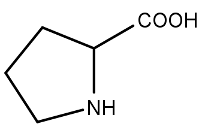
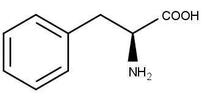
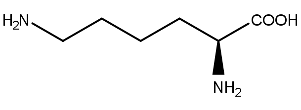

# Kohlenhydrate und Aminosäuren

## Kohlenhydrate

Kohlenhydrate (**Saccharide**, Zucker) sind Polyhydroxyaldehyde bzw. -ketone. Sie bestehen aus einer Kohlenstoffkette mit einer Carbonylgruppe an einem und einer Hydroxygruppe an allen anderen Kohlenstoffatomen. Abhängig von der Position der Carbonylgruppe können Kohlenhydrate in Aldosen (endständig, Aldehyd) und Ketosen (nicht endständig, Keton) eingeteilt werden. Ein weiteres Unterscheidungsmerkmal ist die Anzahl der Kohlenstoffatome (Triose, Tetrose, Pentose, Hexose, Heptose).

### Darstellung

#### Fisher-Projektion

In der Fisher-Projektion wird die Gerüstformel so angeschrieben, dass die Kohlenstoffkette vertikal steht. Die horizontalen Bindungen (zu den Hydroxygruppen und Wasserstoffen) zeigen jeweils aus der Zeichenebene heraus, die vertikalen Bindungen (zwischen den Kohlenstoffen) zeigen nach hinten. Das am höchsten oxidierte Kohlenstoffatom (= die Carbonylgruppe) steht möglichst weit oben.

<figure>
    
    <figcaption></figcaption>
</figure>

<figure>
    
    <figcaption>D-Glucose</figcaption>
</figure>

#### Haworth-Ringformel

Eine Hydroxygruppe, die in der Fisher-Projektion rechts liegt, entspricht einer unterhalb des Rings in der Haworth-Formel. Abhängig davon, ob bei der Halbacetalbildung ein α- oder ein β-Zucker entsteht ergibt sich die Stellung der Gruppe am C1-Atom.

<table class="gallery-table">
    <tbody>
        <tr>
            <td>
                <figure>
                    
                    <figcaption>α-D-Glucose</figcaption>
                </figure>
            </td>
            <td>
                <figure>
                    
                    <figcaption>β-D-Glucose</figcaption>
                </figure>
            </td>
        </tr>
    </tbody>
</table>

#### perspektivisch

<figure>
    
    <figcaption></figcaption>
</figure>

#### Keil-Strich-Formel

<figure>
    
    <figcaption></figcaption>
</figure>

### Stereochemie

Kohlenhydrate haben durch ihre Struktur mehrere chirale Kohlenstoffatome.

#### D- und L-Form

Die Bezeichnung als D- oder L-Zucker hängt von der Absolutkonfiguration des am weitesten von C1 entfernten *chiralen* Kohlenstoffatoms ab. Bei einem D-Zucker ist diese OH-Gruppe in der Fisher-Konfiguration rechts. Bei Kohlenhydraten entspricht dass immer einer R-Konfiguration des letzten Kohlenstoffatoms. Kohlenhydrate kommen in der Natur enantiomerenrein, meist in der D-Form, vor.

<figure>
    
    <figcaption>D- und L-Glycerinaldehyd</figcaption>
</figure>

Die weiteren chiralen Kohlenstoffatome bestimmen, welcher Zucker vorliegt. Der Name hängt von ihrer Absolutkonfiguration im Vergleich zum D/L bestimmenden Atom. D- und L-Glucose unterscheiden sich also nicht nur in diesem einen Kohlenstoffatom, sondern in allen (=> Enantiomere).

<figure>
    
    <figcaption>D- und L-Glucose</figcaption>
</figure>

#### Epimere

Epimere unterscheiden sich in genau einem chiralen Kohlenstoffatom.

<figure>
    
    <figcaption>D-Glucose und D-Galactose</figcaption>
</figure>

### Reaktionen

#### Halbacetalbildung

Kohlenwasserstoffe liegen normalerweise nur zu einem geringen Anteil in offener Form vor. Der größte Anteil liegt in Form eines Rings vor. Die Ringbildung erfolgt über eine Halbacetalbildung zwischen der Hydroxygruppe am C4- oder C5-Atom (C2 und C3 sterisch nicht möglich). Dabei entsteht ein neues chirales Atom an der Position C1. Je nachdem, in welcher Konfiguration diese neue Hydroxygruppe vorliegt, spricht man von α- (S, unten in Haworth-Ringformel) beziehungsweise β-Kohlenhydraten (R, oben in Haworth-Ringformel).

<figure>
    
    <figcaption>Halbacetalbildung von D-Glucose zu β-D-Glucopyranose</figcaption>
</figure>

Eine Halbacetalbildung am C5-Atom erzeugt eine **Pyranose** (6-Ring, Sauerstoff als sechstes Ringelement), am C4-Atom eine **Furanose** (5-Ring). Glucose liegt in wässriger Lösung zu ~$\frac 2 3$ als β-Pyranose und ~$\frac 1 3$ als α-Pyranose im **dynamischen Gleichgewicht** vor. Offenkettige Form und Furanosen sind in vernachlässigbaren Mengen vorhanden.

<figure>
    
    <figcaption>Glucose in Pyranose-Form</figcaption>
</figure>

<figure>
    
    <figcaption>Glucose in Furanose-Form</figcaption>
</figure>

#### Mutarotation

Wie alle chiralen Stoffe sind Kohlenhydrate optisch aktiv. Wenn reine α-Glucose gelöst wird, gleicht sich der Polarisationswinkel mit der Zeit an den der β-Form an, bis der Gleichgewichtspunkt erreicht ist.

##### Reaktionsmechanismus

<figure>
    
    <figcaption>basenkatalysiert</figcaption>
</figure>

<figure>
    
    <figcaption>säurekatalysiert</figcaption>
</figure>

#### Oxidation

Sowohl die Aldehydgruppe einer Aldose als auch der primäre Alkohol am Ende der Kette können zu einer Carboxylgruppe oxidiert werden. Da die Aldehydgruppe leichter oxidiert werden kann, muss man diese mit einer Schutzgruppe versehen, um den Alkohol alleine zu oxidieren. Dadurch kann der Zucker nicht in die Kettenform übergehen und nur der primäre Alkohol ist angreifbar.

<figure>
    
    <figcaption></figcaption>
</figure>

##### Reaktionsmechanismus

<figure>
    
    <figcaption>Bei der Reaktion fällt metallisches Silber aus. Damit kann Zucker in einer Lösung nachgewiesen werden.</figcaption>
</figure>

#### Reduktion

Durch Reduktion der Aldehyd- oder Ketogruppe zu einem Alkohol kann ein Kohlenhydrat zu einem **Alditol** umgewandelt werden. Da nach diesem Prozess beide Enden der Kette mit der gleichen Gruppe enden, kann es dazu kommen, dass eine Symmetrie entsteht (Meso-Form, z.B. bei Galactose). In diesem Fall entfällt die Bezeichnung mit D und L.

<figure>
    
    <figcaption>D-Glucose → D-Glucit/D-Sorbit</figcaption>
</figure>

<figure>
    
    <figcaption>D-Galactose → Dulcit</figcaption>
</figure>

### Glycoside

Glycoside bestehen aus einem Zucker (dem **Glycon**), der eine seiner Hydroxygruppen mit einem **Aglycon** ersetzt hat.

<figure>
    
    <figcaption></figcaption>
</figure>

#### Disaccharide

Disaccharide haben als Aglycon einen weiteren Zucker.

<figure>
    
    <figcaption>Saccharose   = 2-(α-D-Glucopyranosyl)-β-D-fructofuranosid   = Glucose-α,β'-(1→2)-Fructose</figcaption>
</figure>

**weitere wichtige Disaccharide:**

|Name|Aufbau|Vorkommen|
|---|---|---|
|Lactose|Galactose-β'-(1→4)-Glucose|Milchzucker|
|Trehalose|Glucose-α,α'-(1→1)-Glucose|"natürliches Frostschutzmittel"|
|Cellobiose|Glucose-β'-(1→4)-Glucose|Bestandteil von Cellulose|

#### Polysaccharide

Zucker können auch zu längeren Ketten zusammengehängt werden. Polysaccharide wie Chitin, Stärke, Glycogen und Cellulose spielen eine wichtige Rolle als Speicher- und Gerüststoffe.

### wichtige Zucker

<figure>
    
    <figcaption>D-Reihe der Aldosen von der Triose D-Glycerinaldehyd bis zu den Hexosen</figcaption>
</figure>

<figure>
    
    <figcaption>zwei Ketohexosen</figcaption>
</figure>

## Aminosäuren

α-Aminosäuren bestehen aus einer Kette von Kohlenstoffatomen mit einer Carboxylgruppe am C1-Atom und einer Aminogruppe am C2-Atom (= α-C-Atom). Außerdem hängt am C2-Atom jeweils eine Seitenkette, die jeder Aminosäure ihre Funktion gibt.

<figure>
    
    <figcaption>allgemeine Struktur von α-Aminosäuren</figcaption>
</figure>

Für die D/L-Nomenklatur ist im Fall der Aminosäuren die Aminogruppe am C2-Atom verantwortlich. Aminosäuren kommen in der Natur vor allem in der L-Konfiguration vor. Das entspricht (mit Ausnahm von z.B. Cystein) der S-Konfiguration des C2-Atoms. Die kleinste Aminosäure, Glycin, hat als Seitenkette nur einen Wasserstoff, und ist deswegen nicht chiral.

<figure>
    
    <figcaption>Glycin</figcaption>
</figure>

<figure>
    
    <figcaption>L-Cystein   (Schwefel hat eine höhere Ordnungszahl, als Sauerstoff, deswegen ist die Absolutkonfiguration von C2 R.)</figcaption>
</figure>

Aminosäuren tragen eine saure Carboxylgruppe und eine basische Aminogruppe, sind also **amphoter**. Welche der Gruppen protoniert bzw. deprotoniert sind, hängt vom pH-Wert ab. Bei hohem pH-Wert sind beide Gruppen protoniert. Umgekehrt sind bei niedrigen pH-Werten beide gruppen deprotoniert. Dazwischen liegt der **isoelektrische Punkt (pI)**. Dieser ist für jede Aminosäure spezifisch. Wenn der pH-Wert gleich pI ist, liegt die Aminosäure als Zwitterion vor, da die Aminogruppe protoniert ist, die Carboxylgruppe aber deprotoniert. Somit ist das Molekül an einem Ende sauer und am anderen basisch.

<figure>
    
    <figcaption></figcaption>
</figure>

### proteinogene Aminosäuren

In den meisten Lebewesen werden vor allem 20 $\alpha$-Aminosäuren in Proteine eingebaut. Diese **kanonischen** Aminosäuren liegen ausnahmslos in L-Form vor.

#### unpolare aliphatische Aminosäuren

Unpolare Aminosäuren finden sich vor allem im Zentrum von Enzymen, da sie vom umgebenden polaren Medium abgestoßen werden.

<table class="gallery-table" style="text-align: center">
    <thead>
        <tr>
            <th>Name</th>
            <th style="width: 10%">3-Buchstabencode</th>
            <th style="width: 10%">1-Buchstabencode</th>
            <th>Struktur</th>
            <th>Besonderheiten</th>
        </tr>
    </thead>
    <tbody>
        <tr>
            <td style="vertical-align: middle">Glycin</td>
            <td style="vertical-align: middle">Gly</td>
            <td style="vertical-align: middle">G</td>
            <td>
                
            </td>
            <td style="vertical-align: middle">kein chirales Kohlenstoffatom</td>
        </tr>
        <tr>
            <td style="vertical-align: middle">L-Alanin</td>
            <td style="vertical-align: middle">Ala</td>
            <td style="vertical-align: middle">A</td>
            <td>
                
            </td>
            <td style="vertical-align: middle"></td>
        </tr>
        <tr>
            <td style="vertical-align: middle">L-Valin</td>
            <td style="vertical-align: middle">Val</td>
            <td style="vertical-align: middle">V</td>
            <td>
                
            </td>
            <td style="vertical-align: middle"></td>
        </tr>
        <tr>
            <td style="vertical-align: middle">L-Leucin</td>
            <td style="vertical-align: middle">Leu</td>
            <td style="vertical-align: middle">L</td>
            <td>
                
            </td>
            <td style="vertical-align: middle"></td>
        </tr>
        <tr>
            <td style="vertical-align: middle">L-Isoleucin</td>
            <td style="vertical-align: middle">Ile</td>
            <td style="vertical-align: middle">I</td>
            <td>
                
            </td>
            <td style="vertical-align: middle">zwei chirale Zentren</td>
        </tr>
        <tr>
            <td style="vertical-align: middle">L-Methionin</td>
            <td style="vertical-align: middle">Met</td>
            <td style="vertical-align: middle">M</td>
            <td>
                
            </td>
            <td style="vertical-align: middle"></td>
        </tr>
        <tr>
            <td style="vertical-align: middle">L-Prolin</td>
            <td style="vertical-align: middle">Pro</td>
            <td style="vertical-align: middle">P</td>
            <td>
                
            </td>
            <td style="vertical-align: middle"></td>
        </tr>
    </tbody>
</table>

#### polare ungeladene Aminosäuren

Polare Aminosäuren finden sich an der Außenseite von Proteinen und Enzymen.

<table class="gallery-table" style="text-align: center">
    <thead>
        <tr>
            <th>Name</th>
            <th style="width: 10%">3-Buchstabencode</th>
            <th style="width: 10%">1-Buchstabencode</th>
            <th>Struktur</th>
            <th>Besonderheiten</th>
        </tr>
    </thead>
    <tbody>
        <tr>
            <td style="vertical-align: middle">L-Serin</td>
            <td style="vertical-align: middle">Ser</td>
            <td style="vertical-align: middle">S</td>
            <td style="vertical-align: middle">
                
            </td>
            <td style="vertical-align: middle"></td>
        </tr>
        <tr>
            <td style="vertical-align: middle">L-Threonin</td>
            <td style="vertical-align: middle">Thr</td>
            <td style="vertical-align: middle">T</td>
            <td style="vertical-align: middle">
                
            </td>
            <td style="vertical-align: middle">zwei chirale Zentren</td>
        </tr>
        <tr>
            <td style="vertical-align: middle">L-Cystein</td>
            <td style="vertical-align: middle">Cys</td>
            <td style="vertical-align: middle">C</td>
            <td style="vertical-align: middle">
                
            </td>
            <td style="vertical-align: middle">bildet Disulfidbrücken   R-Konfiguration der L-Form</td>
        </tr>
        <tr>
            <td style="vertical-align: middle">L-Asparagin</td>
            <td style="vertical-align: middle">Asn</td>
            <td style="vertical-align: middle">N</td>
            <td style="vertical-align: middle">
                
            </td>
            <td style="vertical-align: middle"></td>
        </tr>
        <tr>
            <td style="vertical-align: middle">L-Glutamin</td>
            <td style="vertical-align: middle">Gln</td>
            <td style="vertical-align: middle">Q</td>
            <td style="vertical-align: middle">
                
            </td>
            <td style="vertical-align: middle"></td>
        </tr>
    </tbody>
</table>

#### aromatische Aminosäuren

Durch ihre $\pi$-Elektronen können aromatische Aminosäuren gut mit Kationen wechselwirken.

<table class="gallery-table" style="text-align: center">
    <thead>
        <tr>
            <th>Name</th>
            <th style="width: 10%">3-Buchstabencode</th>
            <th style="width: 10%">1-Buchstabencode</th>
            <th>Struktur</th>
            <th>Besonderheiten</th>
        </tr>
    </thead>
    <tbody>
        <tr>
            <td style="vertical-align: middle; font-size: 94%">L-Phenylalanin</td>
            <td style="vertical-align: middle">Phe</td>
            <td style="vertical-align: middle">F</td>
            <td style="vertical-align: middle">
                
            </td>
            <td style="vertical-align: middle"></td>
        </tr>
        <tr>
            <td style="vertical-align: middle">L-Tyrosin</td>
            <td style="vertical-align: middle">Tyr</td>
            <td style="vertical-align: middle">Y</td>
            <td style="vertical-align: middle">
                
            </td>
            <td style="vertical-align: middle">bildet gut Wasserstoffbrücken</td>
        </tr>
        <tr>
            <td style="vertical-align: middle">L-Tryptophan</td>
            <td style="vertical-align: middle">Trp</td>
            <td style="vertical-align: middle">W</td>
            <td style="vertical-align: middle">
                
            </td>
            <td style="vertical-align: middle">Die Indolseitenkette ist sehr groß und fungiert oft als "Deckel" von Enzymtaschen.</td>
        </tr>
    </tbody>
</table>

#### geladene Aminosäuren

<table class="gallery-table" style="text-align: center">
    <thead>
        <tr>
            <th>Name</th>
            <th style="width: 10%">3-Buchstabencode</th>
            <th style="width: 10%">1-Buchstabencode</th>
            <th>Struktur</th>
            <th>Besonderheiten</th>
        </tr>
    </thead>
    <tbody>
        <tr>
            <td style="vertical-align: middle">L-Lysin</td>
            <td style="vertical-align: middle">Lys</td>
            <td style="vertical-align: middle">K</td>
            <td style="vertical-align: middle">
                
            </td>
            <td style="vertical-align: middle">positiv, sehr flexible Seitenkette</td>
        </tr>
        <tr>
            <td style="vertical-align: middle">L-Histidin</td>
            <td style="vertical-align: middle">His</td>
            <td style="vertical-align: middle">H</td>
            <td style="vertical-align: middle">
                
            </td>
            <td style="vertical-align: middle">positiv, kann sauer oder basisch reagieren, stabilisiert Substrate</td>
        </tr>
        <tr>
            <td style="vertical-align: middle">L-Arginin</td>
            <td style="vertical-align: middle">Arg</td>
            <td style="vertical-align: middle">R</td>
            <td style="vertical-align: middle">
                
            </td>
            <td style="vertical-align: middle">positiv</td>
        </tr>
        <tr>
            <td style="vertical-align: middle; font-size: 94%">L-Asparaginsäure   L-Aspartat</td>
            <td style="vertical-align: middle">Asp</td>
            <td style="vertical-align: middle">D</td>
            <td style="vertical-align: middle">
                
            </td>
            <td style="vertical-align: middle">Aspartat ist die deprotonierte Form</td>
        </tr>
        <tr>
            <td style="vertical-align: middle; font-size: 94%">L-Glutaminsäure   L-Glutamat</td>
            <td style="vertical-align: middle">Glu</td>
            <td style="vertical-align: middle">E</td>
            <td style="vertical-align: middle">
                
            </td>
            <td style="vertical-align: middle">Glutamat analog zu Aspartat</td>
        </tr>
    </tbody>
</table>

### Synthese

Ein Beispiel für die Herstellung von Aminosäuren ist die Strecker-Synthese. Dabei reagiert ein Aldehyd mit einem Ammoniak-Molekül zu einem Imin. Diese reagiert mit Cyanid und Wasser weiter zur Aminosäure. Das Ergebnis ist eine racemische $\alpha$-Aminosäure.

<figure>
    
    <figcaption></figcaption>
</figure>

### Peptide

Zwei Aminosäuren können zwischen der Carboxylgruppe und der Aminogruppe der beiden Partner eine **Peptidbindung** bilden. Formal erfolgt diese Reaktion unter Abspaltung von Wasser.

<figure>
    
    <figcaption></figcaption>
</figure>

Real ist allerdings der Kohlenstoff der Carboxylgruppe ein schlechtes Elektrophil. Deshalb muss das Molekül erst durch z.B. Dicyclohexylcarbodiimid aktiviert werden. Bei dieser Reaktion entsteht als Zwischenprodukt ein Aktivester.

<figure>
    
    <figcaption></figcaption>
</figure>

Diese Reaktion hat aber immernoch das Problem, das sie sehr unspezifisch ist. Da kein Mechanismus kontrolliert, in welcher Reihefolge die beiden Aminosäuren verknüpft , oder ob zwei gleiche aneinanderghängt werden, macht das erwünschte Produkt nur 25% des Ergebnisses aus.

#### Festphasensynthese nach Merrifield

Bei der Festphasensynthese hängt ein **Linker** an einem festen Polymerkügelchen, das in einer Lösung schwimmt. Von diesem Linker wird ein Halogenid abgespalten, wodurch eine mit einer Schutzgruppe versehene Aminosäure angehängt werden kann. Danach werden die restlichen Aminosäuremoleküle aus der Lösung entfernt und die Schutzgruppe abgespalten. Dann wird die nächste Aminosäure, wieder mit Schutzgruppe, beigegeben und mit der gleichen Reaktion wie oben angehängt. Dieser Prozess wird für eine Aminosäure nach der anderen wiederholt. Da die Reinigung zwischen den einzelnen Schritten durch einfache Filtration erfolgt, lässt sich der Vorgang gut automatisieren. Außerdem hat die Festphasensynthese den Vorteil, dass sie durch die Schutzgruppen hoch selektiv ist, und somit ein bestimmtes Produkt ohne Verluste herstellen lässt.

<figure>
    
    <figcaption></figcaption>
</figure>

#### Proteine

Proteine sind **Polypeptide**. Es gibt keine genaue Grenze, ab wann man von einem Protein spricht, aber die meisten Proteine liegen in einem Bereich von wenigen hundert Aminosäuren. Die **Primärstruktur** gibt die Abfolge der Aminosäuren an. Die **Sekundärstruktur** wird durch Wasserstoffbrückenbindungen des Peptidrückgrats (backbone) bestimmt, und nicht durch die Seitenketten. Zu den wichtigsten Phänomenen auf dieser Ebene gehören $\alpha$-Helices und $\beta$-Faltblätter. Die **Tertiärstruktur** ist die räumliche Anordnung des gesamten Proteins, bestimmt durch verschiedene Interaktionen der Seitenketten.

<figure>
    
    <figcaption>Interaktionen der Tertiärstruktur</figcaption>
</figure>
